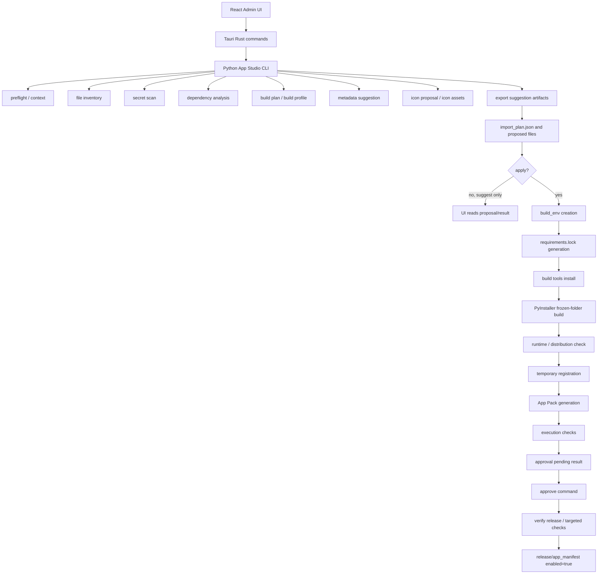

# App Registration Cleanup Audit

監査日: 2026-05-10

## 監査目的

ToolHub App Studio のアプリ登録処理全体を、次の実装フェーズに入る前の監査対象として確認した。

今回の目的は実装修正ではなく、以下を体系的に洗い出すことである。

- 登録フロー全体の責務境界
- 生成 artifact と source of truth の整理
- 無駄、重複、未使用候補、互換維持コードの分類
- 責務混在、巨大関数、巨大 component、呼び出しの煩雑さ
- App Pack、runtime、release readiness との接続課題
- テストと検証の弱点
- 次に Codex へ依頼しやすい改善単位

## 今回変更していないこと

今回の監査では、実装ファイルを変更していない。

- Python 実装は変更していない。
- Rust 実装は変更していない。
- React / TypeScript 実装は変更していない。
- `apps/`、`release/`、`runtime/`、`data/`、`logs/`、生成物は変更していない。
- `launcher/package.json`、`launcher/package-lock.json`、`Cargo.toml`、`Cargo.lock` は変更していない。
- app.yaml public schema、App Pack spec、runner public I/F、release manifest 互換性は変更していない。

追加したのは、この監査結果を記録する `docs/24_app_registration_cleanup_audit.md` のみである。

## 開始時点の git status

最初に sandbox 権限内で `git status --short` を実行したところ、 `.gitignore` へのアクセス拒否や多数の false-positive 的な削除表示が出た。
監査のため同じコマンドを権限許可付きで再確認した結果、実質的な開始時点の dirty file は以下のみだった。

```text
 m .gitup/backups/20260507_193856_rebuild_from_github/current
```

これは今回の監査由来の変更ではない。`.gitup/` はユーザー指定の原則変更しない範囲に該当するため、監査では触れていない。

`docs/00_AI_CONTEXT.md` は存在しなかった。

## 事前確認した guardrails

`docs/23_icon_cleanup_execution_handoff.md` を確認し、アイコン生成まわりは Phase 0-7 cleanup 済みの guardrails として扱った。

今回の監査では、アイコン関連の再設計を主目的にしない。ただし App Studio 全体の登録処理に関係する互換 field、保存済み proposal、UI 正規化境界は監査対象に含めた。

確認した前提:

- App Studio の通常登録は frozen-folder 固定である。
- ローカル生成 fallback icon candidate は廃止済みである。
- ToolHub 共通 default icon は `icon.png` の fallback source だが、candidate や score target ではない。
- `display.icon: icon.png`、`final_app/icon.png`、保存済み proposal の legacy fallback 読み取り互換は維持する。
- `launcher/src/lib/appStudioIconProposal.ts` は icon proposal の UI 正規化境界として扱う。

## App Studio 登録フロー図



管理 UI の update / delete は同じ Rust command 層にあるが、登録処理そのものとは責務が異なる。

## Python CLI flow

主な入口は `tools/app_studio/main.py` である。

1. CLI 引数を受ける。
2. 通常登録の引数を frozen-folder 固定方針へ正規化する。
3. `entry`、`source_root`、`output_dir`、`app_id` から context を作る。
4. file inventory、secret scan、dependency analysis、build plan を実行する。
5. build profile、manual override、AI metadata、icon proposal を組み合わせる。
6. `app.yaml`、README、requirements、icon assets、`import_plan.json` を suggestion output に出す。
7. apply 時は `build_env`、`requirements.lock`、build tools、PyInstaller frozen-folder、runtime check を実行する。
8. temporary registration と App Pack 作成を行う。
9. execution test と timing result を保存する。
10. approve 時は execution result と release verification を確認して、manifest enabled を切り替える。

観察:

- `main.py` は App Studio の処理順序を把握しやすい一方で、全 phase の orchestration と `import_plan` 構築を抱えている。
- 通常登録の frozen-folder 固定方針は Python、Rust、TypeScript、docs に重複している。
- suggest と apply は同じ解析処理を再実行する構造で、source hash ベースの再利用境界がまだ薄い。

## Rust command / Tauri flow

主対象は `launcher/src-tauri/src/app_studio_commands.rs` である。

主要 command:

- `app_studio_preflight`
- `app_studio_suggest`
- `app_studio_apply`
- `app_studio_update_suggest`
- `app_studio_update_apply`
- `app_studio_approve`
- `app_studio_update_approve`
- `app_studio_read_result`
- `app_studio_read_ai_proposal`
- `app_studio_regenerate_icon`
- `app_studio_ai_diagnostics`
- `app_studio_management_*`
- `app_studio_delete_*`

観察:

- 1 ファイルに CLI process 起動、引数正規化、Python 検出、環境変数注入、stdout/stderr mask、artifact 読み取り、UI result 整形、管理 UI、delete plan が集約されている。
- Rust 層は本来 Tauri command の薄い adapter でよいが、現在は App Studio 固有 artifact の読み取り知識が多い。
- `candidate_manifest.json`、`import_plan.json`、execution result、runtime result、approval record、release manifest を Rust 側で再解釈している。
- UI 用の fallback 表示や legacy icon field 互換も Rust 側に一部残っている。

## React UI flow

主対象は `launcher/src/components/admin/appstudio/` と `launcher/src/lib/appStudio*.ts` である。

通常登録の画面 flow:

1. entry / source_root / app_id / name / metadata option を入力する。
2. preflight を実行する。
3. suggest を実行し、AI metadata と icon proposal を表示する。
4. user override や icon adoption を Tauri command 経由で保存する。
5. apply を実行し、build / registration / execution result を読む。
6. approval blocking reason、warning、next action を表示する。
7. approve を実行し、enabled state と App Pack / release verification を表示する。

観察:

- `AppStudioImportWizard.tsx` は state、step 遷移、preflight、suggest/apply/approve、result merge、icon regeneration、message 表示を広く持っている。
- `AppStudioResultPanel.tsx`、`AppStudioImportSidebar.tsx`、`appStudioApproval.ts` に next action / warning / approval 表示ロジックが分散している。
- `appStudioIconProposal.ts` は icon cleanup 後のよい境界であり、他領域にも同様の result normalizer を作る余地がある。
- fixed build policy は UI でも `INITIAL_REQUEST`、`cleanRequest`、`AppStudioBuildOptions.tsx` に重複している。

## scripts / docs flow

関連 script:

- `scripts/package_app_pack.ps1`
- `scripts/verify_release.ps1`
- `scripts/report_release_readiness.ps1`
- `scripts/diagnose_app_studio_import.ps1`
- `scripts/check_all.ps1`
- `scripts/import_app.ps1`
- `scripts/build_release.ps1`
- `scripts/prepare_runtime.ps1`

観察:

- Python の `registrar.py` と PowerShell の `package_app_pack.ps1` は App Pack 作成と manifest 更新に近い知識を持っている。
- Python の `approval.py`、PowerShell の `verify_release.ps1`、Rust result reader は `app.yaml` の `run.entry` / `display.icon` をそれぞれ別に解釈している。
- `diagnose_app_studio_import.ps1` は診断能力が高いが、artifact path、stale result 判定、build profile 判定を独自に持っており、App Studio 本体との重複がある。
- `report_release_readiness.ps1` は App Studio 由来の問題と release readiness 由来の問題を分ける意図が明確で、今後の triage 境界として有用である。

## 生成 artifact 一覧

App Studio output mirror:

- `import_plan.json`
- `file_inventory.json`
- `file_inventory.md`
- `file_inventory_report.md`
- `secret_scan_report.json`
- `secret_scan_report.md`
- `dependency_report.json`
- `dependency_report.md`
- `build_plan.json`
- `build_plan.md`
- `build_profile.json`
- `exe_readiness.json`
- `metadata_report.json`
- `proposed_app.yaml`
- `README.md`
- `requirements.txt`
- `requirements.lock`
- `suggested_toolhubignore`
- `icon_work/candidate_manifest.json`
- `icon_work/icon_candidate_*.png`
- `icon_work/icon_candidate_*.url`
- `icon_work/icon_proposal_report.md`
- `icon_work/icon_fallback.svg` legacy compatibility
- `final_app/`
- `build_env/`
- `build_tmp/`
- `frozen_build_report.json`
- `runtime_check_result.json`
- `registration_report.json`
- `app_pack_report.json`
- `execution_test_result.json`
- `approval_record.md`
- `timing_result.json`

Repository / release side:

- `apps/<app_id>/app.yaml`
- `apps/<app_id>/README.md`
- `apps/<app_id>/requirements.txt`
- `apps/<app_id>/requirements.lock`
- `apps/<app_id>/icon.png`
- `apps/<app_id>/bin/<app_id>/...`
- `release/app_manifest.json`
- `release/app_packs/<app_id>.zip`
- `release/app_packs/<app_id>.pack_manifest.json`
- `backups/app_studio/<timestamp>/...`

User / local state:

- `%LOCALAPPDATA%/ToolHub/data/app_studio/...` の metadata override、icon override、build profile override、logs
- App Studio execution logs

## source of truth 候補と重複情報

現在の source of truth 候補:

| 対象 | source of truth 候補 | 重複している場所 |
| --- | --- | --- |
| アプリ定義 | `apps/<app_id>/app.yaml` | `import_plan.json`、Rust result、UI state、docs examples |
| 表示有効状態 | `release/app_manifest.json` | approval record、Rust catalog read、UI state |
| App Pack content | `release/app_packs/<app_id>.zip` と `pack_manifest.json` | Python report、PowerShell verify、readiness report |
| 登録 run の履歴 | `import_plan.json` と phase result JSON | UI result merge、diagnose script、docs |
| 実行検証 | `execution_test_result.json` | approval decision、result panel、sidebar |
| runtime / distribution 検証 | `runtime_check_result.json` | approval decision、readiness report、diagnose script |
| icon proposal | `icon_work/candidate_manifest.json` | Rust reader、TS normalizer、UI state、legacy flat files |
| final icon | `final_app/icon.png` / `apps/<app_id>/icon.png` | display.icon、candidate manifest、UI preview |
| build policy | frozen-folder fixed constants | Python args、Rust request、TS request、docs |
| requirements lock | `requirements.lock` | import_plan、App Pack、docs、release verification |

重複そのものが悪いわけではない。問題は、どれが authoritative で、どれが historical report かが code 上で明示されていない点である。

## 主要ファイル責務表

| ファイル | 現在の責務 | 呼び出し元 / 利用者 | 生成物 / 影響 | 危険点 |
| --- | --- | --- | --- | --- |
| `tools/app_studio/main.py` | CLI entry、phase orchestration、import_plan 組み立て | Rust command、CLI、script | 全 output mirror、registration | orchestration が大きく、phase contract が暗黙 |
| `tools/app_studio/app_studio/scanner.py` | entry/source_root/output_dir/app_id context | `main.py` | context warning | path policy の重要境界 |
| `tools/app_studio/app_studio/file_classifier.py` | source inventory、include/exclude/manual check | `main.py` | inventory reports | heuristic と magic string が多い |
| `tools/app_studio/app_studio/secret_scanner.py` | secret / unsafe file scan | `main.py` | secret reports、block decision | false positive と block policy の説明責務が重い |
| `tools/app_studio/app_studio/dependency_analyzer.py` | import/dependency 抽出 | `main.py` | dependency report | build plan との境界が薄い |
| `tools/app_studio/app_studio/build_planner.py` | build mode / command plan | `main.py` | build plan | frozen-folder 固定後も旧 mode が残る |
| `tools/app_studio/app_studio/build_profile.py` | PyInstaller add-data / hiddenimports 等 | `main.py`、UI override | build_profile、exe_readiness | manual override と auto detection の境界 |
| `tools/app_studio/app_studio/ai_metadata_suggester.py` | metadata suggestion | `main.py` | metadata report、proposed app.yaml | AI 失敗時の degraded path |
| `tools/app_studio/app_studio/icon_*.py` | icon prompt/candidates/quality/compat | `main.py`、Rust regen | icon_work、icon.png | cleanup 後は guardrail 維持が重要 |
| `tools/app_studio/app_studio/exporter.py` | suggestion artifact 出力、final_app 初期化 | `main.py` | output mirror、final_app | report 重複、legacy icon artifact |
| `tools/app_studio/app_studio/app_env_builder.py` | build_env と legacy app_env 作成 | `main.py` | build_env、cache metadata | 新旧責務が同居 |
| `tools/app_studio/app_studio/lock_generator.py` | requirements.lock 生成 | `main.py` | requirements.lock | App Pack/verify 側の必須性と揃える必要 |
| `tools/app_studio/app_studio/frozen_folder_builder.py` | PyInstaller onedir build | `main.py` | final_app/bin、build report | Windows path/subprocess/build_env 分離が重要 |
| `tools/app_studio/app_studio/runtime_checker.py` | distribution / runtime validation | `main.py`、approval | runtime_check_result | legacy runtime と frozen check が同居 |
| `tools/app_studio/app_studio/registrar.py` | apps copy、manifest update、App Pack 作成 | `main.py` | apps、release/app_manifest、zip | App Pack spec 実装の重複源 |
| `tools/app_studio/app_studio/approval.py` | approval gate、verify release、rollback | `main.py` approve | enabled=true、approval record | verification parser と manifest rollback |
| `tools/app_studio/app_studio/execution_tester.py` | app execution check | `main.py` | execution result | stale result と approval gate |
| `launcher/src-tauri/src/app_studio_commands.rs` | Tauri commands、CLI起動、artifact read、管理/delete | React UI | UI result、logs、overrides | 5k lines 超の責務混在 |
| `launcher/src/lib/appStudioTypes.ts` | Rust/API 型 mirror | React UI | request/result shape | legacy field が UI に露出しやすい |
| `launcher/src/lib/appStudioApi.ts` | Tauri invoke wrapper | React UI | command boundary | 薄いので維持しやすい |
| `launcher/src/lib/appStudioIconProposal.ts` | icon proposal normalizer | UI components | normalized icon view | よい境界。類似境界を他領域へ展開可能 |
| `launcher/src/components/admin/appstudio/AppStudioImportWizard.tsx` | wizard state、run、approval、refresh、icon操作 | Admin UI | 操作 flow | state と business logic が大きい |
| `launcher/src/components/admin/appstudio/AppStudioResultPanel.tsx` | result 表示 | Admin UI | status display | sidebar と next action 表示が重複 |
| `launcher/src/components/admin/appstudio/AppStudioImportSidebar.tsx` | warnings / next action / progress | Admin UI | status display | ResultPanel と判定が重複 |
| `scripts/package_app_pack.ps1` | App Pack 作成 | developer/release | zip、manifest | Python registrar と spec 知識が重複 |
| `scripts/verify_release.ps1` | release verification | approval/check/release | validation report | YAML scalar parsing と App Pack validation 重複 |
| `scripts/diagnose_app_studio_import.ps1` | App Studio diagnosis | developer | diagnosis report | 本体と artifact knowledge が重複 |
| `scripts/check_all.ps1` | broad verification | developer/CI-like | many checks | 環境依存 WARN/FAIL と監査由来を分ける必要 |

## 不健全・無駄・重複の候補一覧

| 優先度 | 候補 | 理由 |
| --- | --- | --- |
| P0 | `requirements.lock` の必須性が App Studio、App Pack、verify_release で完全には同じに見えない | 通常登録成功率と配布再現性に直結する |
| P0 | `run.entry` / `display.icon` / App Pack required entries の検証実装が Python、PowerShell、Rust に分散 | 登録成功後に release 側で壊れる危険 |
| P0 | approval が `execution_test_result.json` の鮮度と対象 app_id に強く依存 | stale result があると承認判断を誤る可能性 |
| P1 | `app_studio_commands.rs` が command、process、artifact parser、management、delete を 1 ファイルに集約 | 変更時の blast radius が大きい |
| P1 | `main.py` が phase orchestration と巨大な `import_plan` 組み立てを保持 | phase 単体テストと再利用が難しい |
| P1 | frozen-folder 固定方針が TS/Rust/Python/docs に重複 | 片方だけ更新されると UI と CLI がずれる |
| P1 | `app_env_builder.py` に legacy app_env と build_env が同居 | 現在方針と旧方針の境界が分かりづらい |
| P1 | App Pack 作成/検証仕様が Python registrar と PowerShell scripts に重複 | 片方だけ厳格化されるリスク |
| P1 | suggest と apply が解析処理を再実行する | 遅いだけでなく suggestion と apply の drift が起きうる |
| P1 | `diagnose_app_studio_import.ps1` が本体と同じ判定知識を多く持つ | 診断が便利な反面、仕様変更時の追随漏れが起きる |
| P2 | UI の next action / warning / approval reason が複数箇所に分散 | 管理者向け表示の一貫性が落ちる |
| P2 | `file_inventory.md` と `file_inventory_report.md` のような似た report がある | historical/compat 目的なら明示したい |
| P2 | docs/15 の update GUI 記述が現在の frozen-folder fixed policy とずれている可能性 | 利用者と実装者を混乱させる |
| P2 | docs/21 は履歴として有用だが、完了済み項目と未完了項目が混ざって見える | 次フェーズ計画の source として整理が必要 |
| P3 | legacy icon fallback fields が各層に残る | 保存済み proposal 互換のため即削除不可 |

## 使用していない可能性があるファイル / 関数 / field 候補

以下は削除確定ではない。互換性、古い output、CLI 利用、test fixture を追加確認してから判断する。

| 候補 | 残っている場所 | 監査メモ |
| --- | --- | --- |
| `build_mode` の `auto` / `app-env` / `existing-exe` | Python models、CLI、Rust validate、TS types | 通常登録では frozen-folder 固定。旧CLI/旧ログ互換の確認が必要 |
| `create_app_env` / `rebuild_app_env` / `skip_app_env_build` | Python args、Rust request、TS request | 通常登録では拒否または false 固定 |
| `skip_lock` / `skip_frozen_build` | Python args | 通常登録では拒否。旧CLI互換か削除候補か要判断 |
| `app_env_builder.create_app_env` | Python module | legacy runtime/app_env 用。build_env と分離候補 |
| `runtime_checker.verify_legacy_runtime` | Python module | 旧 app-env 互換。削除ではなく legacy module 化候補 |
| `build_planner.select_build_mode` の非 frozen branch | Python module | fixed policy 後の active path を確認したい |
| `exporter.populate_final_app_sources` の existing-exe branch | Python module | 通常登録では `.exe` entry を拒否。旧 output 互換か要確認 |
| `scripts/import_app.ps1` の `BuildMode` option | PowerShell | comment 上は ignored。wrapper と docs の整理候補 |
| `icon_work/icon_fallback.svg` | exporter / Rust reader / docs | icon cleanup 後は read-only legacy artifact |
| `fallback_png` / `provisional_fallback_png` | Rust reader / TS types / TS normalizer | 保存済み proposal 互換として維持 |
| `legacy_candidate_png` / flat `icon_candidate_1.*` reader | Rust reader | old candidate manifest 互換として維持 |
| deprecated image summary fields | TS types | old manifest/report 互換として維持 |
| `test/ToolHub_AppStudio_Output/...` | tracked/generated-looking tree | fixture か stale generated output か確認が必要 |

## 互換維持のため残すべきもの

現時点で削除してはいけないもの:

- `app.yaml` public schema と `run.entry` / `display.icon`
- `display.icon: icon.png`
- `icon.png` fallback source と legacy `icon.svg` / `icon_fallback.svg` 読み取り
- 保存済み `import_plan.json`
- 保存済み `candidate_manifest.json` と旧 icon candidate flat files
- `release/app_manifest.json` schema と enabled state
- App Pack zip / `pack_manifest.json` の既存形式
- runner public I/F
- `ToolHub_AppStudio_Output` の既存 output を読める GUI 互換
- user data、logs、browser profile、backup
- runtime 同梱方針と installer/update trust に関わる判断

## 削除候補だが要追加確認のもの

1. 通常登録 UI から見える、または request 型に残る app-env 系 field。
2. Python CLI の `--skip-lock` / `--skip-frozen-build` など、通常登録では拒否する option。
3. `build_mode=auto/app-env/existing-exe` の通常登録 path。
4. `create_app_env` と `verify_legacy_runtime` の現行 module への同居。
5. `scripts/import_app.ps1` の ignored BuildMode option。
6. `exporter.populate_final_app_sources` の existing-exe branch。
7. legacy icon fallback artifact の normal result 表示経路。
8. docs/15 の古い BuildMode / fallback icon 記述。
9. docs/21 の完了済み cleanup 計画項目。
10. tracked/generated-looking `test/ToolHub_AppStudio_Output` 配下の古い出力。

## ファイル構成の改善案

低リスク案:

- `app_studio_commands.rs` から artifact read / parser / request normalization / management delete を分割する。
- `main.py` の `run_import` を phase coordinator と `ImportRunSummary` builder に分ける。
- `app_env_builder.py` を `build_env_builder.py` と `legacy_app_env_builder.py` に分ける。
- `runtime_checker.py` を frozen-folder validator と legacy runtime validator に分ける。
- App Pack spec の required entries / YAML relative path validation を shared helper として Python 側に寄せ、PowerShell は呼び出しまたは同一 spec fixture で検証する。
- UI result normalizer を `appStudioIconProposal.ts` と同じ発想で `appStudioRunResult.ts` へ切り出す。

中リスク案:

- suggest artifact を source hash / build profile hash / metadata override hash で再利用し、apply で同一 run を参照する。
- `import_plan.json` を historical report と authoritative gate data に分ける。
- App Studio の update / delete / registration を Rust command file と UI component の双方で feature module 化する。

高リスク案:

- normal registration から legacy build mode field を public API レベルで削除する。
- saved proposal / old import_plan の読み取り互換を終了する。
- App Pack spec を破壊的に変更する。
- release manifest schema を変更する。
- runtime 同梱方針を変更する。

高リスク案は、今回実装しない。判断を伴う migration plan が必要である。

## コード呼び出し簡素化案

- frozen-folder fixed policy を 1 つの shared policy document と 1 つの typed normalizer に寄せる。
- Rust command は `AppStudioCliRequest` を組み立てるだけに近づけ、artifact parsing は専用 module に分ける。
- Python `main.py` は phase ごとの `PhaseResult` を集めるだけにし、`import_plan` 生成は serializer に寄せる。
- approval decision は Python の gate result を authoritative にし、UI は normalized decision を表示する。
- App Pack validation は `required_files`、`required_zip_entries`、`yaml_relative_paths` を single source として管理する。
- diagnose script は本体と同じ manifest / report schema fixture を読むようにする。

## UI/UX 改善案

- step 表示を「選択」「提案」「登録」「承認」の 4 つに保ちつつ、各 step の blocking reason と next action を 1 箇所の selector から出す。
- 管理者に見せる warning と、開発者向け diagnostic detail を ResultPanel 内で分ける。
- failure reason、next action、approval blocking、warning の語彙を統一する。
- build policy は editable option ではなく fixed policy summary として表示する。
- icon proposal は現在の normalizer 方針を維持し、legacy fallback を通常候補として見せない。
- result refresh 後の state merge を reducer / normalizer 化し、wizard component の state 量を減らす。
- update / delete は registration wizard とは別の mental model として整理し、同一画面内でも境界を明確にする。

## テスト / 検証の不足

現在強いところ:

- Python App Studio unit tests は広い。
- icon cleanup 後の Python/React test は実行履歴が docs/23 に残っている。
- `verify_release.ps1` と `report_release_readiness.ps1` は release 側の問題分類に役立つ。
- `diagnose_app_studio_import.ps1` は実行後 triage に強い。

不足候補:

- Rust command の request normalization / CLI argv / artifact read parser の focused test。
- React App Studio wizard の next action / approval display / result refresh の component-level test。
- App Pack required entries と `requirements.lock` 必須方針の shared fixture test。
- saved old `import_plan` / old `candidate_manifest` の互換 fixture test。
- source_root / output_dir / build_env / final_app / app_pack path safety の regression test。
- stale `execution_test_result.json` を approval が拒否する test。
- `scripts/package_app_pack.ps1` と Python `registrar.package_app_pack` の spec drift test。
- `check_all.ps1` の WARN/FAIL を environment issue と design issue に機械分類する test または report contract。

## release / runtime / App Pack との接続課題

- frozen-folder 標準方針は App Studio 実装、docs/13、runtime checker に反映されている。
- 一方で `runtime/app_envs/<app_id>` の strict policy は release readiness 側でまだ判断が残っている。
- `requirements.lock` 必須方針は App Studio の通常 apply では生成されるが、App Pack packaging / verification の必須 entry として一貫しているか追加確認が必要である。
- App Pack sha256 mismatch は登録処理由来の問題と、release readiness 側の再生成問題を分けて扱うべきである。
- installer artifact 不在、runtime archive 不在、MSVC / cargo policy block は App Studio 登録処理のバグとして扱わない。
- approval は release verification を通すが、release-wide warning と target app failure の分類をさらに明確にできる。

## 改善候補の優先順位

### P0: 現在の登録成功率・安全性に直結

- `requirements.lock` の必須性を App Studio / App Pack / verify_release で揃える。
- `run.entry`、`display.icon`、required zip entries の検証 contract を統一する。
- approval が参照する execution/runtime result の app_id、source hash、freshness を明示する。
- App Pack に不要または危険な build artifacts が混入しないことを packaging 側でも確認する。
- source_root / output_dir / final_app / app_pack の path safety test を増やす。

### P1: コード健全性と保守性に強く効く

- `app_studio_commands.rs` を責務別 module に分割する。
- `main.py` の phase orchestration と report serialization を分ける。
- frozen-folder fixed policy の重複を減らす。
- App Pack spec validation を shared fixture 化する。
- build_env と legacy app_env を module 上も分ける。
- suggest artifact reuse の設計を作る。

### P2: UI/UX改善、分かりやすさ、重複削減

- next action / approval blocking / warning selector を UI 側で 1 箇所にする。
- ResultPanel と Sidebar の warning 表示を統一する。
- 管理者向け summary と developer diagnostics を分離する。
- docs/15 と docs/21 の現状反映を行う。
- import_plan / report / UI state の source-of-truth 注記を docs に追加する。

### P3: 将来の大規模整理

- legacy build mode field を public API から削除する migration。
- old proposal / old fallback artifact の読み取り互換終了。
- App Pack spec の破壊的改訂。
- release manifest schema の改訂。
- runtime packaging 方針の大変更。

## 実装してよい低リスク改善リスト

1. docs/15 の stale な BuildMode / fallback icon 説明を current frozen-folder policy に合わせる。
2. docs/21 の完了済み項目に status を追記し、未完了項目を次フェーズに分ける。
3. TypeScript に `normalizeAppStudioRunResult` を追加し、既存 UI 表示ロジックの重複を少しずつ移す。
4. Rust の artifact read helper を同一ファイル内 module へ先に移し、外部 API は変えない。
5. Python の App Pack required entries を定数化し、registrar / approval の重複を減らす。
6. stale execution result 検出の test を追加する。
7. `requirements.lock` が missing の fixture を追加し、現在の挙動を明文化する。
8. `diagnose_app_studio_import.ps1` に「診断スクリプト独自判定」の注記を追加する。

## 実装前に判断が必要な中-高リスク改善リスト

1. normal registration request schema から legacy field を削除するか、互換 read-only field として残すか。
2. `app_env` legacy support をいつまで維持するか。
3. old `import_plan` / old `candidate_manifest` の読み取り互換をいつ終了するか。
4. `requirements.lock` を App Pack spec 上で完全必須にするか、legacy app だけ例外にするか。
5. release readiness の `runtime/app_envs/<app_id>` strict policy を frozen-folder 標準とどう整合させるか。
6. suggest result を apply で必ず再利用する設計に変えるか、現状の再解析を残すか。
7. App Pack packaging を Python single implementation に寄せるか、PowerShell 実装も維持するか。
8. large module split をどの順序で実施するか。

## 触らない方がよい範囲

- `release/manifest.json`
- `release/app_manifest.json`
- 既存 App Pack zip
- runtime archive / runtime 同梱実体
- installer artifact
- app.yaml public schema
- runner public I/F
- user data
- logs
- backups
- `.gitup/`
- saved old proposal / old import_plan の読み取り互換
- icon cleanup Phase 0-7 の guardrails

## 停止理由と選択肢

今回の監査で見つかった改善候補には、破壊的判断を含むものがあるため、実装は行っていない。

停止対象の例:

- app.yaml public schema の変更
- App Pack spec の変更
- runner public I/F の変更
- release manifest compatibility の変更
- saved proposal / old import_plan / old candidate_manifest の互換破壊
- user data や generated output の削除
- runtime 同梱方針の変更
- installer / signing / update trust の変更
- large refactor

選択肢:

1. 互換維持のまま、validator / normalizer / docs / tests を先に整える。
2. migration period を決めて、legacy field を read-only compatibility として残す。
3. breaking cleanup phase を別途定義し、保存済み output の migration / archive 方針を決めてから削除する。

推奨は 1 から始めること。登録成功率と検証一貫性に効き、破壊的判断が少ない。

## 次回 Codex 用の推奨プロンプト案

### Phase A: App Pack / requirements.lock 検証統一

```text
AGENTS.md と docs/24_app_registration_cleanup_audit.md に従って、
App Studio の frozen-folder 通常登録における requirements.lock 必須方針を監査し、
Python registrar / approval / scripts/verify_release.ps1 / docs の間で挙動を統一してください。
互換性を壊さず、legacy app の扱いを明示し、必要最小限の tests と docs 更新を行ってください。
```

### Phase B: Rust App Studio command 分割

```text
AGENTS.md と docs/24_app_registration_cleanup_audit.md に従って、
launcher/src-tauri/src/app_studio_commands.rs の artifact read / request normalization / command execution / management delete を
外部 command API を変えずに小さな module へ分割してください。
挙動変更を避け、既存 tests と npm build で検証してください。
```

### Phase C: UI result normalizer

```text
AGENTS.md と docs/24_app_registration_cleanup_audit.md に従って、
App Studio UI の approval blocking / warning / next action 表示ロジックを整理してください。
appStudioIconProposal.ts と同じ方針で appStudioRunResult normalizer を追加し、
AppStudioImportWizard / ResultPanel / Sidebar の重複を減らしてください。
```

### Phase D: docs 現状反映

```text
AGENTS.md と docs/24_app_registration_cleanup_audit.md に従って、
docs/15_app_studio_update_gui.md と docs/21_app_registration_improvement_plan.md を現状に合わせて整理してください。
実装済み、legacy compatibility、未実装、判断待ちを明確に分けてください。
```

## 監査で読んだ主要ファイル

- `AGENTS.md`
- `README.md`
- `docs/13_app_studio.md`
- `docs/15_app_studio_update_gui.md`
- `docs/21_app_registration_improvement_plan.md`
- `docs/23_icon_cleanup_execution_handoff.md`
- `docs/05_build_and_release.md`
- `docs/06_acceptance_checklist.md`
- `docs/09_app_pack_spec.md`
- `docs/10_runtime_packaging.md`
- `docs/20_release_readiness_cleanup.md`
- `docs/22_beta_installer_updater_plan.md`
- `tools/app_studio/main.py`
- `tools/app_studio/app_studio/*.py`
- `tools/app_studio/tests/*.py`
- `launcher/src-tauri/src/app_studio_commands.rs`
- `launcher/src-tauri/src/main.rs`
- `launcher/src/components/admin/appstudio/*.tsx`
- `launcher/src/lib/appStudio*.ts`
- `scripts/check_all.ps1`
- `scripts/diagnose_app_studio_import.ps1`
- `scripts/package_app_pack.ps1`
- `scripts/report_release_readiness.ps1`
- `scripts/verify_release.ps1`
- `scripts/build_release.ps1`
- `scripts/prepare_runtime.ps1`
- `runner/`
- `apps/*/app.yaml`
- `release/app_manifest.json`
- `release/manifest.json`

## 今回の未確認事項

- old generated output を実際に参照している tests / scripts の完全な call graph。
- Rust App Studio command の全 unit test coverage。
- React component test の実行結果。
- `requirements.lock` missing の現行 release verification 挙動の実ケース。
- PowerShell scripts が生成する一時ファイルの完全な差分確認。
- `check_all.ps1` の現在環境での最新 WARN/FAIL。
- `.gitup/backups/.../current` の dirty reason。

## 2026-05-10 P0 follow-up: requirements.lock / App Pack / verify_release

実施範囲:

- App Studio frozen-folder app と `runtime.requirements_lock` を明示した app だけを対象に、lock file の必須性を
  Python packaging、approval targeted verification、frozen-folder distribution check、PowerShell packaging、
  `verify_release.ps1`、docs で揃える。
- legacy Python runner 直実行 sample app には一律必須化しない。
- app.yaml public schema、App Pack manifest schema、runner I/F、release manifest compatibility は変更しない。

残した follow-up:

- PowerShell と Python の App Pack contract helper はまだ完全な single source ではない。今回の変更は低リスクな
  判定名と必須 entry の整合に留めた。
- `report_release_readiness.ps1` は App Pack zip/hash/readiness 分類が主目的であり、lock file の詳細検証は
  `verify_release.ps1` に残した。必要なら次フェーズで read-only report に source repair category を追加する。
- legacy app の `requirements.lock` 移行方針は未判断。frozen-folder distribution を宣言していない app には
  互換例外を維持する。

## 2026-05-10 P0 follow-up: contract test 固定

実施範囲:

- generated `app.yaml` が App Studio frozen-folder app として `runtime.requirements_lock: requirements.lock`、
  `display.icon: icon.png`、`run.entry: bin/<app_id>/<app_id>.exe` を出すことを unit test で固定する。
- Python の App Pack required entries helper が `pack_manifest.json`、`README.md`、`requirements.txt`、
  `runtime.requirements_lock`、`display.icon`、`run.entry` を app-relative zip entry として扱うことを固定する。
- legacy Python runner app 相当では `requirements.lock` を一律必須にしない互換例外を unit test で固定する。
- `final_app/requirements.lock` が `apps/<app_id>/requirements.lock` と App Pack zip へ伝搬することを temp repo fixture
  で固定する。

残した follow-up:

- PowerShell helper は parser syntax と `verify_release.ps1` 実行で確認するが、PowerShell 関数単位の isolated
  unit test はまだない。
- Python と PowerShell の required entry contract は同じ挙動に揃っているが、single source 化は未実施。

## 2026-05-10 P0 follow-up: approval result consistency 固定

実施範囲:

- approval gate が `data/logs/app_studio/<app_id>_execution_test_result.json` の `app_id` を確認し、承認対象と異なる
  result を拒否することを unit test で固定した。
- `apps/<app_id>/app.yaml` の `output_mirror` と execution/runtime result の `evidence.output_dir` が両方ある場合、
  異なる `output_dir` の result を拒否することを固定した。
- 既存の execution result stale 判定に加え、runtime result が存在する場合は `final_app/app.yaml` と
  `final_app/run.entry` に対して stale でないことを確認する低リスク gate を追加した。
- runtime result が存在する場合、wrong app、fail check、`overall_status: fail`、approval-blocking warning は承認不可として
  Python unit test で固定した。
- `generated_at` は現時点では履歴表示情報として扱い、鮮度判定は file mtime と artifact consistency に基づくことを
  現行仕様として test で固定した。

残した follow-up:

- `runtime_check_result.json` の存在自体を全 App Studio 登録で必須にするかは、保存済み proposal / old result 互換の
  判断が必要なため未実施。今回の gate は「存在する runtime result を誤用しない」範囲に留めた。
- `generated_at` の厳密な期限、source hash、import_plan hash、build profile hash による freshness 判定は運用判断を伴うため未実施。
- old result 互換のため、`app_id` field が存在しない古い result を一律拒否する判断は未実施。現時点では field が存在して
  承認対象と異なる場合を拒否する。
- Rust / React 側は result 表示を継続し、approval の authoritative decision は Python gate に残した。UI の warning / next action
  の正規化は別フェーズで扱う。

## 2026-05-10 P0 follow-up: approval diagnosis / UI 表示整備

実施範囲:

- approval gate の拒否メッセージに `result_path`、expected/actual、`stale_against`、`next_action`、診断コマンドを含め、
  `approval_record.md` から管理者・開発者が次の操作を追えるようにした。
- `runtime_check_result.json` の stale 表示では、対象を `runtime_check_result.json` として表示するように整えた。
- `diagnose_app_studio_import.ps1` に execution/runtime result の app_id、output_dir、fail、approval-blocking warning、
  runtime stale の分類を追加した。診断は読み取り専用で、実ファイル更新や削除は行わない。
- React UI は `approvalFailureSummary` を `承認ゲート診断` として表示し、wrong app / wrong output_dir / stale /
  execution fail / runtime fail に対する次の操作を日本語で示すようにした。
- TypeScript helper test と Python unit test で、代表的な拒否理由が診断可能な文言を持つことを固定した。

残した follow-up:

- runtime result の存在必須化、`generated_at` 期限判定、source hash freshness 判定は引き続き未実施。
- approval record の stale/old result を UI でいつ無視するかは、保存済み old result 互換と Apply 後 refresh の設計判断が必要。
- Rust command の大規模分割や approval UX の全面再設計は別フェーズに残す。

## 2026-05-10 P1 follow-up: UI result normalizer

実施範囲:

- `launcher/src/lib/appStudioRunResult.ts` を追加し、App Studio run result の表示用 view model を作る境界を設けた。
- approval decision の authoritative source は Python approval gate と `appStudioApproval.ts` の既存 helper に残し、新 normalizer はその結果を UI 表示向けに整形するだけに留めた。
- `AppStudioResultPanel.tsx` から、warning-only 判定、secret block 判定、status label、next action、timing summary、approval record summary、catalog summary などの表示組み立てを normalizer 経由にした。
- `AppStudioImportSidebar.tsx` の next action と result warning は normalizer 経由にし、preflight / AI / icon 固有の注意だけを component 側に残した。
- `AppStudioImportWizard.tsx` の result message と warning-only 判定を normalizer helper に寄せた。
- `AppStudioRunLog.tsx` は warning-only 判定だけを shared helper に寄せた。
- TypeScript unit test で wrong app、stale result、secret scan block、approval-blocking warning、non-blocking warning only、enabled result、missing result の UI 表示契約を固定した。

残した follow-up:

- `AppStudioUpdateWizard.tsx` には update 専用の next action と message helper が残っている。update flow の表示語彙まで normalizer に寄せる場合は、update 用 view model を別途定義してから低リスクに移す。
- React component test は未追加。今回固定したのは pure helper の Vitest unit test である。
- UI の全面再設計、approval UX の根本変更、Rust command 分割、Python approval gate 変更は未実施。

## 2026-05-10 P1 follow-up: Update UI result normalizer

実施範囲:

- `AppStudioUpdateWizard.tsx` に残っていた warning-only 判定、result message、next action のローカル helper を削除し、`appStudioRunResult.ts` の update 用 helper 経由にした。
- update 用 helper は既存の `normalizeAppStudioRunResult()` と `appStudioApproval.ts` の approval decision / guidance を利用し、Python update apply / approve の仕様は変更していない。
- version bump、update proposal、release notes、change summary、metadata/icon 採用、update API 呼び出しは update 固有処理として component 側に残した。
- TypeScript unit test で update apply warning-only、update approve enabled、wrong app / stale next action、suggest 後の test update 誘導、missing result の表示契約を固定した。

残した follow-up:

- UpdateWizard 全体の step 構成や英語見出しの UI 整理は未実施。今回は result / next action / warning 表示ロジックの重複削減に限定した。
- React component test は未追加。今回固定したのは shared helper の Vitest unit test である。
- Rust command 分割、Python update gate 変更、release manifest / App Pack / runner I/F の変更は未実施。

## 2026-05-10 P1 follow-up: Rust artifact reader split

Implemented scope:

- Added `launcher/src-tauri/src/app_studio_result_reader.rs` as the read-only boundary for App Studio run artifacts and result summary construction.
- Moved `AppStudioResultSummary`, `AppStudioTimingPhase`, `read_summary()`, `output_dir_from_app_yaml()`, and the private artifact readers for `import_plan.json`, `execution_test_result.json`, `runtime_check_result.json`, `timing_report.json`, App Pack zip discovery, approval record preview, release manifest enabled/version, and catalog visibility.
- Kept Tauri command names, arguments, return JSON shape, Python CLI behavior, React/TypeScript API shape, app.yaml schema, App Pack spec, runner I/F, and release manifest compatibility unchanged.
- Left process spawn, environment injection, request normalization, management, delete planning/apply, AI proposal/icon artifact reading, and Python command orchestration in `app_studio_commands.rs`.

Remaining follow-up:

- Split AI proposal/icon artifact readers separately after confirming their UI contract and saved proposal compatibility.
- Split process spawn/env/masking into another module only if command wrapper tests or a narrower interface are added first.
- Split management/delete helpers separately; do not combine with artifact reader cleanup because they touch different safety rules and filesystem behaviors.

## 2026-05-10 P1 follow-up: Rust AI proposal/icon reader split

Implemented scope:

- Added `launcher/src-tauri/src/app_studio_ai_proposal_reader.rs` as the read-only boundary for AI proposal metadata and icon artifact loading.
- Moved the `AppStudioAiProposal` / metadata / icon suggestion structs, `read_ai_proposal()`, proposed YAML metadata parsing, `import_plan.json` AI report/release note fallback, `candidate_manifest.json` parsing, `icon_candidate_1.png`, `icon_candidate_1.url.txt`, `icon_final.png`, prompt/report readers, and legacy flat candidate compatibility into the new module.
- Kept `app_studio_commands.rs` as the command/process boundary and re-exported the moved public structs so Tauri command names, arguments, return JSON shape, and TypeScript API shape remain unchanged.
- Preserved icon cleanup guardrails: default icon is read only as final/current preview via `icon_final.png`, not as an AI candidate; local fallback image candidates were not reintroduced; legacy fallback candidates remain marked by their existing `fallback`/source metadata for the UI normalizer to hide.

Remaining follow-up:

- Add isolated Rust unit tests for `app_studio_ai_proposal_reader.rs` once `cargo` is not blocked by Windows application control policy.
- Keep any future fallback/default icon behavior changes in Python `icon_compat.py` and TypeScript `appStudioIconProposal.ts`; do not make Rust reader semantics authoritative for UI filtering.
- Process spawn/env/masking and management/delete splitting remain separate P1/P2 work.

## 2026-05-10 P1 follow-up: Rust CLI argv builder split

Implemented scope:

- Added `launcher/src-tauri/src/app_studio_cli_args.rs` as the pure request normalization and CLI argv builder boundary for App Studio Rust commands.
- Moved normal registration frozen-folder normalization, update-to-import request mapping, import suggest/apply argv construction, approve argv construction, image-test argv construction, and icon-regenerate argv construction out of `app_studio_commands.rs`.
- Kept override temp file writing, Python discovery, environment injection, stdout/stderr masking, process spawn, management, and delete plan/apply in `app_studio_commands.rs`.
- Kept Tauri command names, arguments, return JSON shape, React/TypeScript API shape, Python CLI flag names/order, app.yaml schema, App Pack spec, runner I/F, and release manifest compatibility unchanged.
- Added Rust unit tests around the pure builder contract for frozen-folder normalization, import suggest/apply flags, update request mapping, approve strict/allow-warnings flags, icon-regenerate optional controls, and image-test model override trimming.

Remaining follow-up:

- Move process spawn/env/masking only after a narrow command execution adapter is defined; do not combine it with CLI argv builder cleanup.
- Keep management/delete helpers separate because they touch filesystem safety and repo-managed target rules.
- `cargo check` remains blocked in this environment by Windows application control policy, so the new Rust tests should be run in an environment where `rustc` is allowed.
