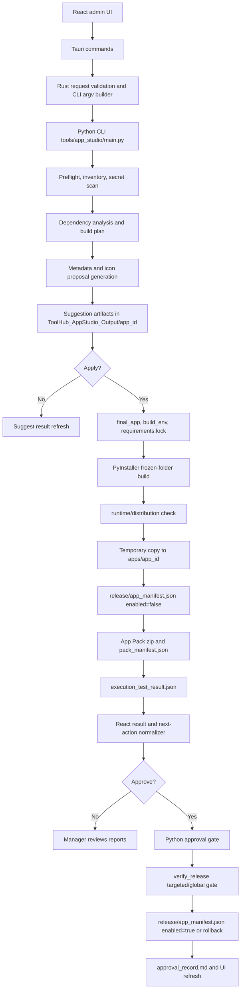
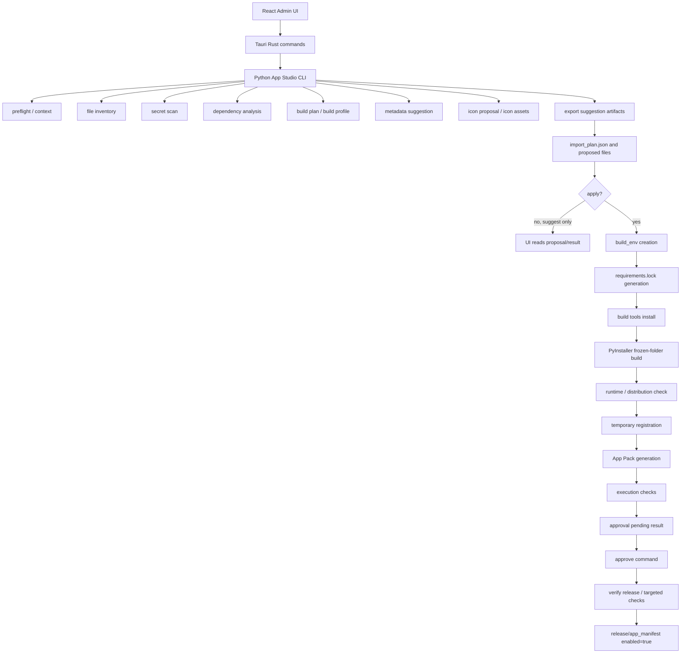

# App Registration Cleanup Audit

監査日: 2026-05-10

## 監査目的

ToolHub App Studio のアプリ登録処理全体を、次の実装フェーズに入る前の監査対象として確認した。

今回の目的は実装修正ではなく、以下を体系的に洗い出すことである。

- 登録フロー全体の責務境界
- 生成 artifact と source of truth の整理
- 無駄、重複、未使用候補、互換維持コードの分類
- 責務混在、巨大関数、巨大 component、呼び出しの煩雑さ
- App Pack、runtime、release readiness との接続課題
- テストと検証の弱点
- 次に Codex へ依頼しやすい改善単位

## 今回変更していないこと

今回の監査では、実装ファイルを変更していない。

- Python 実装は変更していない。
- Rust 実装は変更していない。
- React / TypeScript 実装は変更していない。
- `apps/`、`release/`、`runtime/`、`data/`、`logs/`、生成物は変更していない。
- `launcher/package.json`、`launcher/package-lock.json`、`Cargo.toml`、`Cargo.lock` は変更していない。
- app.yaml public schema、App Pack spec、runner public I/F、release manifest 互換性は変更していない。

追加したのは、この監査結果を記録する `docs/24_app_registration_cleanup_audit.md` のみである。

## 開始時点の git status

最初に sandbox 権限内で `git status --short` を実行したところ、 `.gitignore` へのアクセス拒否や多数の false-positive 的な削除表示が出た。
監査のため同じコマンドを権限許可付きで再確認した結果、実質的な開始時点の dirty file は以下のみだった。

```text
 m .gitup/backups/20260507_193856_rebuild_from_github/current
```

これは今回の監査由来の変更ではない。`.gitup/` はユーザー指定の原則変更しない範囲に該当するため、監査では触れていない。

## 2026-05-10 full registration cleanup re-audit

### Audit metadata

- Audit date: 2026-05-10
- Purpose: review the whole ToolHub App Studio app registration flow and prepare cleanup material for later implementation phases.
- Scope: App Studio Python CLI, Rust/Tauri commands, React admin UI, PowerShell packaging/release scripts, docs, runner/release/runtime touch points, and representative app manifests.
- Code changes made in this phase: none.
- Files intentionally not changed: Python implementation, React implementation, Rust implementation, PowerShell scripts, `apps/`, `release/`, `runtime/`, generated output, user data, lock files, Cargo files, package files, existing `app.yaml`, App Pack artifacts, installer artifacts.
- Documentation change in this phase: this audit section only.
- Starting `git status --short`:

```text
 m .gitup/backups/20260507_193856_rebuild_from_github/current
```

The `.gitup` file was already dirty before this audit and was not touched.

### Pre-implementation self review

- Objective: produce an audit document, not a refactor.
- Main allowed edit: `docs/24_app_registration_cleanup_audit.md`.
- Interface risk: app.yaml schema, App Pack spec, runner I/F, release manifest compatibility, saved proposal compatibility, and user data must remain untouched.
- Verification risk: broad checks such as `check_all.ps1` can be noisy because they may touch generated assets, hit Cargo/MSVC policy limits, or report existing release readiness gaps. This phase uses read-only inspection plus minimal diff validation.
- Scope guard: icon cleanup is treated as completed guardrails from `docs/23_icon_cleanup_execution_handoff.md`; this audit does not reopen fallback/default icon behavior.

### Icon cleanup guardrails carried forward

The icon cleanup handoff remains a separate completed phase. New cleanup work must preserve:

- Default icon is not an AI candidate.
- Local fallback image candidates are not reintroduced.
- Fallback adoption UI is not restored.
- Saved proposal, old `candidate_manifest.json`, and legacy flat `icon_candidate_1.png` / `.url.txt` compatibility stay readable.
- `display.icon: icon.png` remains the normal generated app icon contract.
- `appStudioIconProposal.ts` remains the UI-side icon proposal normalizer boundary.

### App Studio registration flow diagram



### Python CLI flow

Normal registration currently flows through `tools/app_studio/main.py`:

1. Parse CLI flags for import, approve, image-test, and icon-regenerate.
2. Enforce normal registration policy in `normalize_normal_registration_args()`: Python source only, frozen-folder build, requirements lock generation, runtime verification, no runtime `app_env`.
3. Create `StudioContext` and timing recorder.
4. Run file inventory, secret scan, dependency analysis, build planning, build profile merge, exe readiness analysis.
5. Run metadata and icon suggestion, apply metadata/icon overrides, and build the `GeneratedArtifacts` payload.
6. Write suggestion artifacts with `exporter.export_suggestion()`.
7. On Apply, create internal `build_env`, generate `requirements.lock`, install build tools, run PyInstaller frozen-folder build, run runtime/distribution check.
8. Copy `final_app/` to `apps/<app_id>/`, update `release/app_manifest.json` with `enabled=false`, generate App Pack, mirror the pack back to output, run execution checks.
9. On Approve, `approval.py` validates result identity/freshness, flips `enabled=true`, repackages App Pack, runs targeted and global release verification, and rolls back on app-specific failure.

### Rust command / Tauri flow

Current split boundaries:

- `app_studio_result_reader.rs`: read-only result summary from import plan, execution/runtime/timing reports, App Pack path, approval record, release manifest, and catalog visibility.
- `app_studio_ai_proposal_reader.rs`: read-only AI metadata/icon proposal loading, including legacy candidate compatibility.
- `app_studio_cli_args.rs`: normal registration request normalization and CLI argv builders for import/update/approve/icon-regenerate/image-test.
- `app_studio_process.rs`: process output shaping, stdout/stderr masking, GUI log append, command-line logging, arg redaction.
- `app_studio_overrides.rs`: metadata/icon/build-profile override files and icon revision PNG temp files.

`app_studio_commands.rs` still owns:

- Tauri command wrappers and admin session checks.
- Public request/response DTO structs serialized to TypeScript.
- Python executable discovery and Python missing diagnostics.
- AI/API env plan and env injection.
- Actual `Command::new(...).output()` process execution and orchestration order.
- Preflight and file picker helpers.
- Management list / show-hide.
- Delete plan and full-delete apply.
- Shared path, app id, YAML/JSON, semver, stdout extraction, and catalog helper functions.

This is improved from the original single-file state, but the file remains the central orchestrator.

### React UI flow

- `AppStudioImportWizard.tsx`: new registration wizard state, suggest/apply/approve calls, metadata/icon override adoption, operation banner, result refresh.
- `AppStudioUpdateWizard.tsx`: update proposal/apply/approve UI; now shares result message and next-action helpers where the result type matches the normal registration flow.
- `AppStudioResultPanel.tsx`: detailed result, approval state, App Pack/release/runtime/execution summaries.
- `AppStudioImportSidebar.tsx`: step summary, warnings, next action.
- `AppStudioRunLog.tsx`: stdout/stderr/log display with warning-only handling.
- `appStudioRunResult.ts`: view normalizer for run result status, warning-only, next action, timing, catalog, approval guidance.
- `appStudioApproval.ts`: UI helper for approval decision/guidance, while Python remains the authoritative approval gate.
- `appStudioIconProposal.ts`: UI normalizer for AI icon proposals and legacy candidate filtering.

### Generated artifacts

| Artifact | Producer | Primary consumer | Notes |
| --- | --- | --- | --- |
| `ToolHub_AppStudio_Output/<app_id>/import_plan.json` | Python main/export/trace | Rust result reader, UI, diagnosis | Broad historical report and summary source, not the final runtime truth. |
| `file_inventory.json` / `.md` | Python file classifier | Developer/admin review | Supports source scope and exclusion decisions. |
| `secret_scan_report.md` | Python secret scanner | UI, admin, approval troubleshooting | Blocks Apply for real package risk. |
| `dependency_report.json` | Python dependency analyzer | build plan, reports | Input for build plan and requirements generation. |
| `proposed_app.yaml` | Python manifest generator | UI review, final export | Draft app schema before Apply. |
| `proposed_README.md` | Python readme generator | final app, App Pack | Required App Pack entry after Apply. |
| `proposed_requirements.txt` | Python dependency analyzer/exporter | final app requirements | Becomes `requirements.txt`. |
| `build_profile.json` | Python build profile | PyInstaller and runtime checks | Some data is also mirrored into reports and UI summary. |
| `build_env/` | Python app env builder | PyInstaller, lock generator | Internal build environment only; not runtime/user-facing. |
| `requirements.lock` | Python lock generator | runtime checker, App Pack, verify_release | Required for App Studio frozen-folder apps, not all legacy apps. |
| `final_app/` | Python exporter/builder | registrar copy, runtime check | Staged source of truth for the app directory immediately before temporary registration. |
| `runtime_check_result.json` | Python runtime checker | approval gate, Rust result reader, diagnose | Optional historical artifact for legacy paths, required in current normal Apply result path. |
| `execution_test_result.json` | Python execution tester | approval gate, Rust result reader, diagnose | Primary approval precondition for normal registration. |
| `apps/<app_id>/app.yaml` | registrar copy from final_app | runner, release scripts, UI management | Public app schema source for installed/registered app. |
| `release/app_manifest.json` | registrar/approval/scripts | launcher catalog, release scripts | Release app visibility and package source of truth. |
| `release/app_packs/<app_id>-<version>.zip` | registrar/package script | release/update distribution | Must contain required entries, pack manifest, and hash. |
| `pack_manifest.json` inside zip | registrar/package script | verify/release consumers | App Pack-internal metadata. |
| `approval_record.md` | approval gate | UI summary, diagnose, admin | Historical approval outcome and verification evidence. |
| `timing_report.json` / `.md` | timing recorder | UI progress/estimates, audit | Useful for performance, not correctness source of truth. |

### Source of truth and duplicated information

| Data | Best current source of truth | Duplicates / historical mirrors | Drift risk |
| --- | --- | --- | --- |
| App identity and runtime contract | `apps/<app_id>/app.yaml` after Apply | `proposed_app.yaml`, `import_plan.json`, UI state, `release/app_manifest.json` | Medium. Identity fields are copied and summarized in many places. |
| Visibility for launcher catalog | `release/app_manifest.json` | Rust management list, approval record, UI result | Medium. Disabled stale entries are valid history but easy to misread. |
| App Pack payload | `release/app_packs/*.zip` plus `release/app_manifest.json` hash | output mirror `app_pack/`, `registration_copy_report.md`, `pack_manifest.json` | Medium. Python and PowerShell check similar required entries. |
| Frozen-folder execution entry | `app.yaml` `run.entry` and actual `final_app/bin/...exe` | import plan, runtime result, execution result, verify_release | Medium-high if old result files are trusted. P0 gate now mitigates. |
| requirements lock | `app.yaml` `runtime.requirements_lock` plus actual file | `requirements.lock` fallback in App Pack/verify helpers, docs/tests | Medium. Improved by contract tests; still duplicated in Python/PowerShell. |
| Approval decision | Python `approval.py` gate | TS display helpers, approval record, diagnose script | Medium. UI must stay presentation-only. |
| Icon candidates | `icon_work/candidate_manifest.json` plus final `icon_final.png` | legacy flat candidate files, import plan, UI normalizer | Low-medium. Guardrails exist; compatibility code is intentionally retained. |
| Build policy | Python `normalize_normal_registration_args()` | Rust CLI normalizer, React build options, docs | Medium. Same frozen-folder policy exists in three languages. |

### Major file responsibility table

| File | Current responsibility | Main callers | Generated/observed artifacts | Audit risk |
| --- | --- | --- | --- | --- |
| `tools/app_studio/main.py` | CLI parsing and full import orchestration | Rust commands, scripts | Most output-dir artifacts | Large function and phase orchestration are still centralized. |
| `tools/app_studio/app_studio/registrar.py` | copy final app, update manifest, App Pack generation | `main.py`, `approval.py` | `apps/<app_id>`, `release/app_manifest.json`, App Pack | App Pack contract overlaps PowerShell. |
| `tools/app_studio/app_studio/approval.py` | approval gate, release verification, rollback | CLI approve | approval record, manifest enabled=true/rollback | Correctness critical; result freshness policy is intentionally conservative but still mtime-based. |
| `tools/app_studio/app_studio/runtime_checker.py` | frozen-folder distribution checks | `main.py`, tests | runtime check reports/results | Good focus, but legacy-vs-normal exception handling remains mixed. |
| `tools/app_studio/app_studio/execution_tester.py` | execution checks and approval summary | `main.py` | execution test reports/results | Approval categories are shared conceptually with UI and docs. |
| `tools/app_studio/app_studio/exporter.py` | suggestion/final app export and icon candidate files | `main.py` | `final_app/`, icon work, reports | Keeps legacy icon candidate compatibility. |
| `tools/app_studio/app_studio/app_env_builder.py` | internal build_env and legacy app_env builders | `main.py`, tests | build_env reports/cache | Two env concepts remain in one module. |
| `launcher/src-tauri/src/app_studio_commands.rs` | Tauri command orchestration and remaining management/delete/discovery | React API | command results and management results | Still large, though read/argv/process/override helpers are split. |
| `launcher/src-tauri/src/app_studio_cli_args.rs` | Rust request normalization and argv building | app_studio_commands | none | Duplicates Python normal registration policy by design. |
| `launcher/src-tauri/src/app_studio_result_reader.rs` | result summary artifact reader | app_studio_commands | none | Read-only, good boundary. |
| `launcher/src-tauri/src/app_studio_ai_proposal_reader.rs` | AI/icon proposal reader | app_studio_commands | none | Compatibility-heavy but isolated. |
| `launcher/src/lib/appStudioRunResult.ts` | UI result view normalizer | ResultPanel, Sidebar, Wizard, RunLog | none | Good boundary; still relies on raw result shape. |
| `launcher/src/lib/appStudioApproval.ts` | UI approval guidance | run result normalizer/UI | none | Must remain non-authoritative. |
| `launcher/src/components/admin/appstudio/AppStudioImportWizard.tsx` | normal import UI state and actions | Admin UI | none | Large component with many workflow concerns. |
| `launcher/src/components/admin/appstudio/AppStudioUpdateWizard.tsx` | update UI state and actions | Admin UI | none | Improved result helper reuse, still update-state heavy. |
| `launcher/src/components/admin/appstudio/AppStudioDeleteManager.tsx` | management/delete UI | Admin UI | none | Many label/status helpers remain local. |
| `scripts/package_app_pack.ps1` | App Pack creation/check script | release/check scripts/manual | App Pack and manifest updates | Duplicates Python App Pack path/schema checks. |
| `scripts/verify_release.ps1` | release readiness validation | approval, check scripts/manual | stdout status | Critical independent gate, but checks duplicate Python helpers. |
| `scripts/diagnose_app_studio_import.ps1` | read-only diagnosis | admin/dev | optional JSON/text report | Useful, but duplicates freshness/path/classification logic. |
| `scripts/report_release_readiness.ps1` | readiness classification | check_all/manual | stdout/report | Some warnings are release-wide, not registration-specific. |
| `docs/13_app_studio.md` | main App Studio user/dev docs | humans | none | Long and partially mojibake in local display; content needs terminology cleanup. |
| `docs/15_app_studio_update_gui.md` | update GUI docs | humans | none | Contains old fallback/icon wording that should be reviewed. |

### Unhealthy, waste, and duplication candidates

| Priority | Candidate | Why it matters | Status |
| --- | --- | --- | --- |
| P0 | App Pack/requirements/run.entry checks split across Python and PowerShell | Registration can pass but release can fail if contracts drift. | Improved with tests; no single source yet. |
| P0 | Approval depends on result artifacts | Stale or wrong-app results can approve the wrong state. | P0 gate improved; still mtime/artifact based. |
| P0 | Result source of truth split | UI, approval, diagnose, and release read different artifacts. | Needs continued documentation and normalizer boundaries. |
| P1 | `main.py` orchestration remains large | Phase order and artifact writes are implicit in one function. | Candidate for phase orchestrator, not immediate breaking refactor. |
| P1 | `app_studio_commands.rs` remains large | Tauri DTOs, discovery, env, process, management, delete still co-located. | Several helpers split; DTO/preflight/management remain next candidates. |
| P1 | Normal registration policy duplicated | Python, Rust, TS, docs must agree on frozen-folder/lock/runtime checks. | Low-risk tests help; still no shared spec file. |
| P1 | `app_env_builder.py` mixes build_env and app_env | Normal path only uses internal build_env; legacy app_env code remains. | Compatibility boundary should be clearer. |
| P1 | PowerShell YAML parsing duplicated | `package_app_pack.ps1` and `verify_release.ps1` repeat scalar/path helpers. | Safe to consolidate only with script tests. |
| P2 | UI workflow state is component-heavy | Wizard components own many action branches and messages. | Normalizers helped; component state remains complex. |
| P2 | Docs contain historical/fallback terminology | Can mislead future cleanup work, especially icon fallback wording. | Docs-only cleanup candidate. |
| P2 | Delete management labels and safety helpers are split UI/Rust | Display wording and backend categories can drift. | Keep behavior stable; consider normalizer later. |
| P3 | Legacy proposal/candidate compatibility code | Adds complexity but protects saved outputs. | Do not delete without migration window. |

### Possibly unused files, functions, or fields

These are not deletion recommendations. They need call graph checks, fixture checks, and compatibility decisions first.

| Candidate | Type | Initial signal | Keep/delete bias |
| --- | --- | --- | --- |
| `_legacy_suggest_icon_prompt_removed` in AI metadata/icon code | Function | Name indicates removed behavior shim. | Delete candidate after confirming no tests/imports. |
| `icon_generator.py` compatibility facade | Module | Cleanup left dedicated newer icon modules. | Keep until imports and docs prove it is unused. |
| Legacy `fallback_png` / `provisional_fallback_png` fields | Saved proposal fields | Old output compatibility only. | Keep for saved proposal compatibility. |
| Legacy flat `icon_candidate_1.png` / `.url.txt` readers | Compatibility readers | Old output compatibility. | Keep until migration/archive policy exists. |
| `create_app_env`, `rebuild_app_env`, `skip_app_env_build` normal request fields | Request fields | Normal registration rejects/normalizes them. | Keep until TypeScript/Rust/Python compatibility decision. |
| `app-env` / `existing-exe` / `auto` build mode docs and tests | Legacy modes | Normal UI does not expose them. | Keep as historical schema compatibility, but separate docs. |
| `verify_legacy_runtime()` | Runtime checker branch | Normal path uses frozen-folder. | Keep for old/imported data compatibility. |
| Stale docs in `docs/15_app_studio_update_gui.md` | Documentation | Search found fallback/local fallback wording. | Low-risk docs cleanup. |
| Local test/output folders under `test/` or old ToolHub output mirrors | Files/fixtures | Generated-looking paths may exist. | Do not delete until fixture ownership is identified. |
| Duplicate PowerShell App Pack helper functions | Script functions | Same names/logic as Python equivalents. | Consolidate only if tests can cover both scripts. |

### Compatibility code that should remain

- Existing `app.yaml` schema and optional/legacy fields.
- App Pack layout and `pack_manifest.json` schema.
- Runner public I/F and launcher-runner contract.
- `release/app_manifest.json` and `release/manifest.json` schema/version compatibility.
- Disabled stale release manifest entries until a deliberate full-delete policy is used.
- Saved proposals, old import plans, old candidate manifests, and legacy flat icon candidate files.
- Legacy Python runner sample apps that do not declare frozen-folder distribution and should not be forced to have `requirements.lock`.
- Runtime packaging assumptions: runtime may not be fully bundled in dev environments.
- User data and external references discovered by delete planning.
- App Studio default icon and fallback semantics from the icon cleanup handoff.

### Delete candidates requiring additional confirmation

1. Remove `_legacy_suggest_icon_prompt_removed` if no imports/tests reference it.
2. Remove or rename stale docs around AI/local fallback candidates after comparing against icon cleanup guardrails.
3. Hide legacy build-mode controls/types from normal registration DTOs only after saved request compatibility is decided.
4. Split or retire runtime/app_env creation paths from normal App Studio docs, while keeping code for old app compatibility.
5. Remove old generated output fixtures only after identifying whether tests/scripts read them.
6. Collapse duplicated PowerShell YAML/path helper code only after script syntax and behavior tests are added.
7. Remove old fallback icon candidate reader fields only after archived proposals no longer need them.
8. Retire direct Python runner registration examples from App Studio docs only if they are moved to a separate legacy section.
9. Remove unused UI helper functions only after TypeScript `rg` and `npm test` confirm no usage.
10. Remove stale disabled manifest entries only through the full-delete flow, never as an incidental cleanup.

### File structure improvement ideas

- Python: split `main.py` into `cli.py`, `import_orchestrator.py`, `approval_cli.py`, and `icon_regenerate_cli.py` only after tests lock current stdout/artifact behavior.
- Python: split `app_env_builder.py` into `build_env_builder.py` and `legacy_app_env_builder.py` or add clearer facade names.
- Python: consider an `app_pack_contract.py` shared by registrar/approval/tests, then mirror the same rule names in PowerShell docs.
- Rust: next safe split is public DTOs into `app_studio_types.rs`, preserving `serde(rename_all = "camelCase")` and public re-exports.
- Rust: split preflight/discovery after tests cover runtime-python priority and PATH fallback.
- Rust: split management/delete as a dedicated safety domain, not as part of process cleanup.
- React: continue moving result/next-action display decisions into `appStudioRunResult.ts`; leave workflow state in components.
- React: consider a small management/delete UI normalizer after backend categories stabilize.
- Docs: separate current normal registration policy from legacy compatibility notes.

### Call simplification ideas

- Keep Python approval as the authoritative gate; UI helpers should only classify and explain.
- Keep `verify_release.ps1` as an independent release gate, but align check names with Python App Pack contract tests.
- Reduce repeated "what is next action" branching in UI by expanding the run result normalizer rather than adding component-specific helpers.
- Treat `import_plan.json` as historical summary and make `app.yaml`, result JSON, App Pack zip, and release manifest the explicit correctness artifacts.
- Avoid moving process spawn/env injection until there is a narrow executor adapter with tests for secret handling and log order.
- Avoid consolidating PowerShell/Python YAML parsing by string sharing; instead first document identical rule names and test examples.

### UI/UX improvement ideas

- Keep admin-facing messages focused on cause, expected/actual, file path, and next action.
- Do not expose all internal phase names in the main wizard; keep detailed reports linked in result panels.
- Make warning severity vocabulary consistent: fail, approval-blocking warning, non-blocking warning, info.
- Keep Apply, Approve, result refresh, Update, and Delete actions visually separate.
- For stale/wrong-app/wrong-output results, always show the result file and the operation to rerun.
- In update UI, keep version/release-note specifics in the update component and shared result state in the normalizer.
- In delete UI, treat user data and external references as excluded/safety information, not normal delete candidates.

### Test and validation gaps

- Python unit tests now cover many frozen-folder, App Pack, requirements.lock, runtime, and approval consistency cases, but `main.py` full orchestration remains hard to test without expensive builds.
- TypeScript pure helper tests cover approval/run result/icon/metadata/version logic, but React component behavior remains mostly untested.
- Rust helper tests exist for recent helper splits, but local `cargo check` has been reported as blocked by Windows application control policy in prior phases.
- PowerShell scripts have syntax checks and manual/targeted execution, but not isolated unit tests for each helper function.
- `check_all.ps1` can conflate design issues with environment gaps such as missing MSVC, blocked cargo, missing installer artifact, incomplete runtime bundle, or existing App Pack hash mismatch.
- Fixture vs generated-output ownership is not fully documented for old `test/` and App Studio output mirrors.

### Release, runtime, and App Pack connection issues

- Normal App Studio registration is frozen-folder, but release readiness still reports broader runtime/app_env concerns for the whole product. These should stay separate in reports.
- `requirements.lock` is required for App Studio frozen-folder apps, but not for legacy Python runner sample apps unless they declare the frozen-folder contract.
- App Pack required entries are checked by Python and PowerShell with similar but duplicated logic.
- Approval runs targeted app verification and `verify_release.ps1`; global pre-existing release warnings should not be treated as newly introduced app failures.
- Existing App Pack sha256 mismatch or missing installer artifact is a release readiness issue unless caused by the current registration.
- Runtime bundle absence is a release packaging issue, not proof that the frozen-folder app registration artifact is invalid.

### Priority backlog

| Priority | Improvement | Rationale |
| --- | --- | --- |
| P0 | Keep approval stale/wrong-app/wrong-output tests maintained | Direct approval safety. |
| P0 | Keep requirements.lock/App Pack/verify_release contract tests maintained | Direct registration success and release compatibility. |
| P0 | Add targeted examples for release verification failures that mention the current app | Prevent rollback/report drift. |
| P1 | Split Rust DTOs into `app_studio_types.rs` | Low behavior risk and reduces `app_studio_commands.rs` size. |
| P1 | Split Python import orchestration phases behind a facade | Improves maintainability but must preserve artifacts/stdout. |
| P1 | Clarify build_env vs legacy app_env module/docs | Reduces conceptual debt for normal registration. |
| P1 | Add PowerShell script helper tests or golden samples | Reduces Python/PowerShell rule drift. |
| P2 | Clean docs/15 and older fallback terminology | Improves operator/developer clarity. |
| P2 | Add UI component-level smoke tests for result/approval displays | Protects normalizer integration. |
| P2 | Add management/delete normalizer | Reduces UI label drift. |
| P3 | Archive or migrate old proposal/legacy candidate formats | Enables future deletion of compatibility readers. |
| P3 | Large App Studio architecture split | Useful only after smaller boundaries are stable. |

### Low-risk improvements that can be implemented next

- Docs-only cleanup of stale fallback wording in `docs/15_app_studio_update_gui.md` and related references.
- Rust DTO split into `app_studio_types.rs` with exact field names and `serde` attributes preserved.
- Add explicit source-of-truth table to `docs/13_app_studio.md`.
- Add more pure helper tests for `app_studio_cli_args.rs` and `app_studio_process.rs` if cargo is available.
- Add PowerShell parser/syntax validation to a focused test script without changing script behavior.
- Align wording of App Pack required entries between docs, Python error messages, and PowerShell messages.
- Document legacy app exceptions in a separate compatibility section.

### Medium to high risk improvements requiring a decision first

- Make `runtime_check_result.json` mandatory for all approval paths. This needs saved/old result compatibility decisions.
- Introduce `generated_at` expiry or source-hash freshness. This needs operational policy and old proposal migration decisions.
- Change release readiness strict policy around missing app_env skeletons for frozen-folder apps. This affects release acceptance semantics.
- Create a single implementation source for Python and PowerShell App Pack validation. This may require a cross-language contract artifact or generated checks.
- Move Python process discovery/env injection/spawn into a Rust executor module. This can affect secret handling and log order.
- Delete legacy build modes or compatibility fields. This risks app.yaml/request/proposal compatibility.
- Full Python `main.py` phase refactor. This must preserve stdout, output files, timings, and failure behavior.
- Delete old disabled/stale manifest entries or generated outputs. This requires user data and full-delete policy decisions.

### Areas to avoid touching without explicit approval

- `apps/`, `release/`, `runtime/`, `data/`, `logs/`, generated App Studio output, App Pack zips, installer artifacts.
- `launcher/package-lock.json`, `launcher/src-tauri/Cargo.lock`, package/Cargo dependency manifests.
- App.yaml public schema, App Pack schema, runner public I/F, release manifest compatibility.
- Saved proposal and legacy icon candidate compatibility.
- User data, external references, and shared runtime paths discovered by delete planning.
- Python discovery/env injection/process spawn behavior unless dedicated tests and approval exist.

### Recommended next Codex implementation prompt

```text
AGENTS.md rules apply. In one pass, implement, self-review, and validate.

Purpose:
As a P1 cleanup for ToolHub App Studio, split only the public Rust DTO/request/response structs from
launcher/src-tauri/src/app_studio_commands.rs into launcher/src-tauri/src/app_studio_types.rs.

Constraints:
- Do not change Tauri command names, arguments, return JSON shape, serde rename attributes, or React/TypeScript API shape.
- Do not change Python discovery, env injection, process spawn, management, delete, App Pack, app.yaml, runner, release manifest, or Python CLI behavior.
- Re-export/import moved structs so existing commands compile with the same public shape.
- Update docs/24 with the boundary and follow-up.

Validation:
- rustfmt --edition 2021 --check launcher/src-tauri/src/app_studio_commands.rs launcher/src-tauri/src/app_studio_types.rs
- cd launcher/src-tauri; cargo check
- cd launcher; npm run build if cargo succeeds or if TypeScript shape concerns appear
- git diff --check
```

### Stop-condition findings

No stop condition blocked this audit because no implementation change was made. The following remain stop conditions for future work:

- Breaking app.yaml schema, App Pack spec, runner I/F, or release manifest compatibility.
- Breaking saved proposal, old import_plan, old candidate_manifest, or legacy flat candidate compatibility.
- Deleting user data or generated outputs without a full-delete/migration decision.
- Changing runtime bundle policy, installer/signing/update trust, or Python env injection behavior.
- Large refactors that cannot be validated in the current environment.

### Post-audit self review

- Scope control: only documentation was changed.
- Interface impact: none.
- Generated artifacts: none intentionally changed.
- Dirty unrelated file: `.gitup/backups/20260507_193856_rebuild_from_github/current` remains unrelated.
- Main residual risk: some existing docs render as mojibake in local PowerShell output; the audit section was written in ASCII to avoid adding new encoding ambiguity.

`docs/00_AI_CONTEXT.md` は存在しなかった。

## 事前確認した guardrails

`docs/23_icon_cleanup_execution_handoff.md` を確認し、アイコン生成まわりは Phase 0-7 cleanup 済みの guardrails として扱った。

今回の監査では、アイコン関連の再設計を主目的にしない。ただし App Studio 全体の登録処理に関係する互換 field、保存済み proposal、UI 正規化境界は監査対象に含めた。

確認した前提:

- App Studio の通常登録は frozen-folder 固定である。
- ローカル生成 fallback icon candidate は廃止済みである。
- ToolHub 共通 default icon は `icon.png` の fallback source だが、candidate や score target ではない。
- `display.icon: icon.png`、`final_app/icon.png`、保存済み proposal の legacy fallback 読み取り互換は維持する。
- `launcher/src/lib/appStudioIconProposal.ts` は icon proposal の UI 正規化境界として扱う。

## App Studio 登録フロー図



管理 UI の update / delete は同じ Rust command 層にあるが、登録処理そのものとは責務が異なる。

## Python CLI flow

主な入口は `tools/app_studio/main.py` である。

1. CLI 引数を受ける。
2. 通常登録の引数を frozen-folder 固定方針へ正規化する。
3. `entry`、`source_root`、`output_dir`、`app_id` から context を作る。
4. file inventory、secret scan、dependency analysis、build plan を実行する。
5. build profile、manual override、AI metadata、icon proposal を組み合わせる。
6. `app.yaml`、README、requirements、icon assets、`import_plan.json` を suggestion output に出す。
7. apply 時は `build_env`、`requirements.lock`、build tools、PyInstaller frozen-folder、runtime check を実行する。
8. temporary registration と App Pack 作成を行う。
9. execution test と timing result を保存する。
10. approve 時は execution result と release verification を確認して、manifest enabled を切り替える。

観察:

- `main.py` は App Studio の処理順序を把握しやすい一方で、全 phase の orchestration と `import_plan` 構築を抱えている。
- 通常登録の frozen-folder 固定方針は Python、Rust、TypeScript、docs に重複している。
- suggest と apply は同じ解析処理を再実行する構造で、source hash ベースの再利用境界がまだ薄い。

## Rust command / Tauri flow

主対象は `launcher/src-tauri/src/app_studio_commands.rs` である。

主要 command:

- `app_studio_preflight`
- `app_studio_suggest`
- `app_studio_apply`
- `app_studio_update_suggest`
- `app_studio_update_apply`
- `app_studio_approve`
- `app_studio_update_approve`
- `app_studio_read_result`
- `app_studio_read_ai_proposal`
- `app_studio_regenerate_icon`
- `app_studio_ai_diagnostics`
- `app_studio_management_*`
- `app_studio_delete_*`

観察:

- 1 ファイルに CLI process 起動、引数正規化、Python 検出、環境変数注入、stdout/stderr mask、artifact 読み取り、UI result 整形、管理 UI、delete plan が集約されている。
- Rust 層は本来 Tauri command の薄い adapter でよいが、現在は App Studio 固有 artifact の読み取り知識が多い。
- `candidate_manifest.json`、`import_plan.json`、execution result、runtime result、approval record、release manifest を Rust 側で再解釈している。
- UI 用の fallback 表示や legacy icon field 互換も Rust 側に一部残っている。

## React UI flow

主対象は `launcher/src/components/admin/appstudio/` と `launcher/src/lib/appStudio*.ts` である。

通常登録の画面 flow:

1. entry / source_root / app_id / name / metadata option を入力する。
2. preflight を実行する。
3. suggest を実行し、AI metadata と icon proposal を表示する。
4. user override や icon adoption を Tauri command 経由で保存する。
5. apply を実行し、build / registration / execution result を読む。
6. approval blocking reason、warning、next action を表示する。
7. approve を実行し、enabled state と App Pack / release verification を表示する。

観察:

- `AppStudioImportWizard.tsx` は state、step 遷移、preflight、suggest/apply/approve、result merge、icon regeneration、message 表示を広く持っている。
- `AppStudioResultPanel.tsx`、`AppStudioImportSidebar.tsx`、`appStudioApproval.ts` に next action / warning / approval 表示ロジックが分散している。
- `appStudioIconProposal.ts` は icon cleanup 後のよい境界であり、他領域にも同様の result normalizer を作る余地がある。
- fixed build policy は UI でも `INITIAL_REQUEST`、`cleanRequest`、`AppStudioBuildOptions.tsx` に重複している。

## scripts / docs flow

関連 script:

- `scripts/package_app_pack.ps1`
- `scripts/verify_release.ps1`
- `scripts/report_release_readiness.ps1`
- `scripts/diagnose_app_studio_import.ps1`
- `scripts/check_all.ps1`
- `scripts/import_app.ps1`
- `scripts/build_release.ps1`
- `scripts/prepare_runtime.ps1`

観察:

- Python の `registrar.py` と PowerShell の `package_app_pack.ps1` は App Pack 作成と manifest 更新に近い知識を持っている。
- Python の `approval.py`、PowerShell の `verify_release.ps1`、Rust result reader は `app.yaml` の `run.entry` / `display.icon` をそれぞれ別に解釈している。
- `diagnose_app_studio_import.ps1` は診断能力が高いが、artifact path、stale result 判定、build profile 判定を独自に持っており、App Studio 本体との重複がある。
- `report_release_readiness.ps1` は App Studio 由来の問題と release readiness 由来の問題を分ける意図が明確で、今後の triage 境界として有用である。

## 生成 artifact 一覧

App Studio output mirror:

- `import_plan.json`
- `file_inventory.json`
- `file_inventory.md`
- `file_inventory_report.md`
- `secret_scan_report.json`
- `secret_scan_report.md`
- `dependency_report.json`
- `dependency_report.md`
- `build_plan.json`
- `build_plan.md`
- `build_profile.json`
- `exe_readiness.json`
- `metadata_report.json`
- `proposed_app.yaml`
- `README.md`
- `requirements.txt`
- `requirements.lock`
- `suggested_toolhubignore`
- `icon_work/candidate_manifest.json`
- `icon_work/icon_candidate_*.png`
- `icon_work/icon_candidate_*.url`
- `icon_work/icon_proposal_report.md`
- `icon_work/icon_fallback.svg` legacy compatibility
- `final_app/`
- `build_env/`
- `build_tmp/`
- `frozen_build_report.json`
- `runtime_check_result.json`
- `registration_report.json`
- `app_pack_report.json`
- `execution_test_result.json`
- `approval_record.md`
- `timing_result.json`

Repository / release side:

- `apps/<app_id>/app.yaml`
- `apps/<app_id>/README.md`
- `apps/<app_id>/requirements.txt`
- `apps/<app_id>/requirements.lock`
- `apps/<app_id>/icon.png`
- `apps/<app_id>/bin/<app_id>/...`
- `release/app_manifest.json`
- `release/app_packs/<app_id>.zip`
- `release/app_packs/<app_id>.pack_manifest.json`
- `backups/app_studio/<timestamp>/...`

User / local state:

- `%LOCALAPPDATA%/ToolHub/data/app_studio/...` の metadata override、icon override、build profile override、logs
- App Studio execution logs

## source of truth 候補と重複情報

現在の source of truth 候補:

| 対象 | source of truth 候補 | 重複している場所 |
| --- | --- | --- |
| アプリ定義 | `apps/<app_id>/app.yaml` | `import_plan.json`、Rust result、UI state、docs examples |
| 表示有効状態 | `release/app_manifest.json` | approval record、Rust catalog read、UI state |
| App Pack content | `release/app_packs/<app_id>.zip` と `pack_manifest.json` | Python report、PowerShell verify、readiness report |
| 登録 run の履歴 | `import_plan.json` と phase result JSON | UI result merge、diagnose script、docs |
| 実行検証 | `execution_test_result.json` | approval decision、result panel、sidebar |
| runtime / distribution 検証 | `runtime_check_result.json` | approval decision、readiness report、diagnose script |
| icon proposal | `icon_work/candidate_manifest.json` | Rust reader、TS normalizer、UI state、legacy flat files |
| final icon | `final_app/icon.png` / `apps/<app_id>/icon.png` | display.icon、candidate manifest、UI preview |
| build policy | frozen-folder fixed constants | Python args、Rust request、TS request、docs |
| requirements lock | `requirements.lock` | import_plan、App Pack、docs、release verification |

重複そのものが悪いわけではない。問題は、どれが authoritative で、どれが historical report かが code 上で明示されていない点である。

## 主要ファイル責務表

| ファイル | 現在の責務 | 呼び出し元 / 利用者 | 生成物 / 影響 | 危険点 |
| --- | --- | --- | --- | --- |
| `tools/app_studio/main.py` | CLI entry、phase orchestration、import_plan 組み立て | Rust command、CLI、script | 全 output mirror、registration | orchestration が大きく、phase contract が暗黙 |
| `tools/app_studio/app_studio/scanner.py` | entry/source_root/output_dir/app_id context | `main.py` | context warning | path policy の重要境界 |
| `tools/app_studio/app_studio/file_classifier.py` | source inventory、include/exclude/manual check | `main.py` | inventory reports | heuristic と magic string が多い |
| `tools/app_studio/app_studio/secret_scanner.py` | secret / unsafe file scan | `main.py` | secret reports、block decision | false positive と block policy の説明責務が重い |
| `tools/app_studio/app_studio/dependency_analyzer.py` | import/dependency 抽出 | `main.py` | dependency report | build plan との境界が薄い |
| `tools/app_studio/app_studio/build_planner.py` | build mode / command plan | `main.py` | build plan | frozen-folder 固定後も旧 mode が残る |
| `tools/app_studio/app_studio/build_profile.py` | PyInstaller add-data / hiddenimports 等 | `main.py`、UI override | build_profile、exe_readiness | manual override と auto detection の境界 |
| `tools/app_studio/app_studio/ai_metadata_suggester.py` | metadata suggestion | `main.py` | metadata report、proposed app.yaml | AI 失敗時の degraded path |
| `tools/app_studio/app_studio/icon_*.py` | icon prompt/candidates/quality/compat | `main.py`、Rust regen | icon_work、icon.png | cleanup 後は guardrail 維持が重要 |
| `tools/app_studio/app_studio/exporter.py` | suggestion artifact 出力、final_app 初期化 | `main.py` | output mirror、final_app | report 重複、legacy icon artifact |
| `tools/app_studio/app_studio/app_env_builder.py` | build_env と legacy app_env 作成 | `main.py` | build_env、cache metadata | 新旧責務が同居 |
| `tools/app_studio/app_studio/lock_generator.py` | requirements.lock 生成 | `main.py` | requirements.lock | App Pack/verify 側の必須性と揃える必要 |
| `tools/app_studio/app_studio/frozen_folder_builder.py` | PyInstaller onedir build | `main.py` | final_app/bin、build report | Windows path/subprocess/build_env 分離が重要 |
| `tools/app_studio/app_studio/runtime_checker.py` | distribution / runtime validation | `main.py`、approval | runtime_check_result | legacy runtime と frozen check が同居 |
| `tools/app_studio/app_studio/registrar.py` | apps copy、manifest update、App Pack 作成 | `main.py` | apps、release/app_manifest、zip | App Pack spec 実装の重複源 |
| `tools/app_studio/app_studio/approval.py` | approval gate、verify release、rollback | `main.py` approve | enabled=true、approval record | verification parser と manifest rollback |
| `tools/app_studio/app_studio/execution_tester.py` | app execution check | `main.py` | execution result | stale result と approval gate |
| `launcher/src-tauri/src/app_studio_commands.rs` | Tauri commands、CLI起動、artifact read、管理/delete | React UI | UI result、logs、overrides | 5k lines 超の責務混在 |
| `launcher/src/lib/appStudioTypes.ts` | Rust/API 型 mirror | React UI | request/result shape | legacy field が UI に露出しやすい |
| `launcher/src/lib/appStudioApi.ts` | Tauri invoke wrapper | React UI | command boundary | 薄いので維持しやすい |
| `launcher/src/lib/appStudioIconProposal.ts` | icon proposal normalizer | UI components | normalized icon view | よい境界。類似境界を他領域へ展開可能 |
| `launcher/src/components/admin/appstudio/AppStudioImportWizard.tsx` | wizard state、run、approval、refresh、icon操作 | Admin UI | 操作 flow | state と business logic が大きい |
| `launcher/src/components/admin/appstudio/AppStudioResultPanel.tsx` | result 表示 | Admin UI | status display | sidebar と next action 表示が重複 |
| `launcher/src/components/admin/appstudio/AppStudioImportSidebar.tsx` | warnings / next action / progress | Admin UI | status display | ResultPanel と判定が重複 |
| `scripts/package_app_pack.ps1` | App Pack 作成 | developer/release | zip、manifest | Python registrar と spec 知識が重複 |
| `scripts/verify_release.ps1` | release verification | approval/check/release | validation report | YAML scalar parsing と App Pack validation 重複 |
| `scripts/diagnose_app_studio_import.ps1` | App Studio diagnosis | developer | diagnosis report | 本体と artifact knowledge が重複 |
| `scripts/check_all.ps1` | broad verification | developer/CI-like | many checks | 環境依存 WARN/FAIL と監査由来を分ける必要 |

## 不健全・無駄・重複の候補一覧

| 優先度 | 候補 | 理由 |
| --- | --- | --- |
| P0 | `requirements.lock` の必須性が App Studio、App Pack、verify_release で完全には同じに見えない | 通常登録成功率と配布再現性に直結する |
| P0 | `run.entry` / `display.icon` / App Pack required entries の検証実装が Python、PowerShell、Rust に分散 | 登録成功後に release 側で壊れる危険 |
| P0 | approval が `execution_test_result.json` の鮮度と対象 app_id に強く依存 | stale result があると承認判断を誤る可能性 |
| P1 | `app_studio_commands.rs` が command、process、artifact parser、management、delete を 1 ファイルに集約 | 変更時の blast radius が大きい |
| P1 | `main.py` が phase orchestration と巨大な `import_plan` 組み立てを保持 | phase 単体テストと再利用が難しい |
| P1 | frozen-folder 固定方針が TS/Rust/Python/docs に重複 | 片方だけ更新されると UI と CLI がずれる |
| P1 | `app_env_builder.py` に legacy app_env と build_env が同居 | 現在方針と旧方針の境界が分かりづらい |
| P1 | App Pack 作成/検証仕様が Python registrar と PowerShell scripts に重複 | 片方だけ厳格化されるリスク |
| P1 | suggest と apply が解析処理を再実行する | 遅いだけでなく suggestion と apply の drift が起きうる |
| P1 | `diagnose_app_studio_import.ps1` が本体と同じ判定知識を多く持つ | 診断が便利な反面、仕様変更時の追随漏れが起きる |
| P2 | UI の next action / warning / approval reason が複数箇所に分散 | 管理者向け表示の一貫性が落ちる |
| P2 | `file_inventory.md` と `file_inventory_report.md` のような似た report がある | historical/compat 目的なら明示したい |
| P2 | docs/15 の update GUI 記述が現在の frozen-folder fixed policy とずれている可能性 | 利用者と実装者を混乱させる |
| P2 | docs/21 は履歴として有用だが、完了済み項目と未完了項目が混ざって見える | 次フェーズ計画の source として整理が必要 |
| P3 | legacy icon fallback fields が各層に残る | 保存済み proposal 互換のため即削除不可 |

## 使用していない可能性があるファイル / 関数 / field 候補

以下は削除確定ではない。互換性、古い output、CLI 利用、test fixture を追加確認してから判断する。

| 候補 | 残っている場所 | 監査メモ |
| --- | --- | --- |
| `build_mode` の `auto` / `app-env` / `existing-exe` | Python models、CLI、Rust validate、TS types | 通常登録では frozen-folder 固定。旧CLI/旧ログ互換の確認が必要 |
| `create_app_env` / `rebuild_app_env` / `skip_app_env_build` | Python args、Rust request、TS request | 通常登録では拒否または false 固定 |
| `skip_lock` / `skip_frozen_build` | Python args | 通常登録では拒否。旧CLI互換か削除候補か要判断 |
| `app_env_builder.create_app_env` | Python module | legacy runtime/app_env 用。build_env と分離候補 |
| `runtime_checker.verify_legacy_runtime` | Python module | 旧 app-env 互換。削除ではなく legacy module 化候補 |
| `build_planner.select_build_mode` の非 frozen branch | Python module | fixed policy 後の active path を確認したい |
| `exporter.populate_final_app_sources` の existing-exe branch | Python module | 通常登録では `.exe` entry を拒否。旧 output 互換か要確認 |
| `scripts/import_app.ps1` の `BuildMode` option | PowerShell | comment 上は ignored。wrapper と docs の整理候補 |
| `icon_work/icon_fallback.svg` | exporter / Rust reader / docs | icon cleanup 後は read-only legacy artifact |
| `fallback_png` / `provisional_fallback_png` | Rust reader / TS types / TS normalizer | 保存済み proposal 互換として維持 |
| `legacy_candidate_png` / flat `icon_candidate_1.*` reader | Rust reader | old candidate manifest 互換として維持 |
| deprecated image summary fields | TS types | old manifest/report 互換として維持 |
| `test/ToolHub_AppStudio_Output/...` | tracked/generated-looking tree | fixture か stale generated output か確認が必要 |

## 互換維持のため残すべきもの

現時点で削除してはいけないもの:

- `app.yaml` public schema と `run.entry` / `display.icon`
- `display.icon: icon.png`
- `icon.png` fallback source と legacy `icon.svg` / `icon_fallback.svg` 読み取り
- 保存済み `import_plan.json`
- 保存済み `candidate_manifest.json` と旧 icon candidate flat files
- `release/app_manifest.json` schema と enabled state
- App Pack zip / `pack_manifest.json` の既存形式
- runner public I/F
- `ToolHub_AppStudio_Output` の既存 output を読める GUI 互換
- user data、logs、browser profile、backup
- runtime 同梱方針と installer/update trust に関わる判断

## 削除候補だが要追加確認のもの

1. 通常登録 UI から見える、または request 型に残る app-env 系 field。
2. Python CLI の `--skip-lock` / `--skip-frozen-build` など、通常登録では拒否する option。
3. `build_mode=auto/app-env/existing-exe` の通常登録 path。
4. `create_app_env` と `verify_legacy_runtime` の現行 module への同居。
5. `scripts/import_app.ps1` の ignored BuildMode option。
6. `exporter.populate_final_app_sources` の existing-exe branch。
7. legacy icon fallback artifact の normal result 表示経路。
8. docs/15 の古い BuildMode / fallback icon 記述。
9. docs/21 の完了済み cleanup 計画項目。
10. tracked/generated-looking `test/ToolHub_AppStudio_Output` 配下の古い出力。

## ファイル構成の改善案

低リスク案:

- `app_studio_commands.rs` から artifact read / parser / request normalization / management delete を分割する。
- `main.py` の `run_import` を phase coordinator と `ImportRunSummary` builder に分ける。
- `app_env_builder.py` を `build_env_builder.py` と `legacy_app_env_builder.py` に分ける。
- `runtime_checker.py` を frozen-folder validator と legacy runtime validator に分ける。
- App Pack spec の required entries / YAML relative path validation を shared helper として Python 側に寄せ、PowerShell は呼び出しまたは同一 spec fixture で検証する。
- UI result normalizer を `appStudioIconProposal.ts` と同じ発想で `appStudioRunResult.ts` へ切り出す。

中リスク案:

- suggest artifact を source hash / build profile hash / metadata override hash で再利用し、apply で同一 run を参照する。
- `import_plan.json` を historical report と authoritative gate data に分ける。
- App Studio の update / delete / registration を Rust command file と UI component の双方で feature module 化する。

高リスク案:

- normal registration から legacy build mode field を public API レベルで削除する。
- saved proposal / old import_plan の読み取り互換を終了する。
- App Pack spec を破壊的に変更する。
- release manifest schema を変更する。
- runtime 同梱方針を変更する。

高リスク案は、今回実装しない。判断を伴う migration plan が必要である。

## コード呼び出し簡素化案

- frozen-folder fixed policy を 1 つの shared policy document と 1 つの typed normalizer に寄せる。
- Rust command は `AppStudioCliRequest` を組み立てるだけに近づけ、artifact parsing は専用 module に分ける。
- Python `main.py` は phase ごとの `PhaseResult` を集めるだけにし、`import_plan` 生成は serializer に寄せる。
- approval decision は Python の gate result を authoritative にし、UI は normalized decision を表示する。
- App Pack validation は `required_files`、`required_zip_entries`、`yaml_relative_paths` を single source として管理する。
- diagnose script は本体と同じ manifest / report schema fixture を読むようにする。

## UI/UX 改善案

- step 表示を「選択」「提案」「登録」「承認」の 4 つに保ちつつ、各 step の blocking reason と next action を 1 箇所の selector から出す。
- 管理者に見せる warning と、開発者向け diagnostic detail を ResultPanel 内で分ける。
- failure reason、next action、approval blocking、warning の語彙を統一する。
- build policy は editable option ではなく fixed policy summary として表示する。
- icon proposal は現在の normalizer 方針を維持し、legacy fallback を通常候補として見せない。
- result refresh 後の state merge を reducer / normalizer 化し、wizard component の state 量を減らす。
- update / delete は registration wizard とは別の mental model として整理し、同一画面内でも境界を明確にする。

## テスト / 検証の不足

現在強いところ:

- Python App Studio unit tests は広い。
- icon cleanup 後の Python/React test は実行履歴が docs/23 に残っている。
- `verify_release.ps1` と `report_release_readiness.ps1` は release 側の問題分類に役立つ。
- `diagnose_app_studio_import.ps1` は実行後 triage に強い。

不足候補:

- Rust command の request normalization / CLI argv / artifact read parser の focused test。
- React App Studio wizard の next action / approval display / result refresh の component-level test。
- App Pack required entries と `requirements.lock` 必須方針の shared fixture test。
- saved old `import_plan` / old `candidate_manifest` の互換 fixture test。
- source_root / output_dir / build_env / final_app / app_pack path safety の regression test。
- stale `execution_test_result.json` を approval が拒否する test。
- `scripts/package_app_pack.ps1` と Python `registrar.package_app_pack` の spec drift test。
- `check_all.ps1` の WARN/FAIL を environment issue と design issue に機械分類する test または report contract。

## release / runtime / App Pack との接続課題

- frozen-folder 標準方針は App Studio 実装、docs/13、runtime checker に反映されている。
- 一方で `runtime/app_envs/<app_id>` の strict policy は release readiness 側でまだ判断が残っている。
- `requirements.lock` 必須方針は App Studio の通常 apply では生成されるが、App Pack packaging / verification の必須 entry として一貫しているか追加確認が必要である。
- App Pack sha256 mismatch は登録処理由来の問題と、release readiness 側の再生成問題を分けて扱うべきである。
- installer artifact 不在、runtime archive 不在、MSVC / cargo policy block は App Studio 登録処理のバグとして扱わない。
- approval は release verification を通すが、release-wide warning と target app failure の分類をさらに明確にできる。

## 改善候補の優先順位

### P0: 現在の登録成功率・安全性に直結

- `requirements.lock` の必須性を App Studio / App Pack / verify_release で揃える。
- `run.entry`、`display.icon`、required zip entries の検証 contract を統一する。
- approval が参照する execution/runtime result の app_id、source hash、freshness を明示する。
- App Pack に不要または危険な build artifacts が混入しないことを packaging 側でも確認する。
- source_root / output_dir / final_app / app_pack の path safety test を増やす。

### P1: コード健全性と保守性に強く効く

- `app_studio_commands.rs` を責務別 module に分割する。
- `main.py` の phase orchestration と report serialization を分ける。
- frozen-folder fixed policy の重複を減らす。
- App Pack spec validation を shared fixture 化する。
- build_env と legacy app_env を module 上も分ける。
- suggest artifact reuse の設計を作る。

### P2: UI/UX改善、分かりやすさ、重複削減

- next action / approval blocking / warning selector を UI 側で 1 箇所にする。
- ResultPanel と Sidebar の warning 表示を統一する。
- 管理者向け summary と developer diagnostics を分離する。
- docs/15 と docs/21 の現状反映を行う。
- import_plan / report / UI state の source-of-truth 注記を docs に追加する。

### P3: 将来の大規模整理

- legacy build mode field を public API から削除する migration。
- old proposal / old fallback artifact の読み取り互換終了。
- App Pack spec の破壊的改訂。
- release manifest schema の改訂。
- runtime packaging 方針の大変更。

## 実装してよい低リスク改善リスト

1. docs/15 の stale な BuildMode / fallback icon 説明を current frozen-folder policy に合わせる。
2. docs/21 の完了済み項目に status を追記し、未完了項目を次フェーズに分ける。
3. TypeScript に `normalizeAppStudioRunResult` を追加し、既存 UI 表示ロジックの重複を少しずつ移す。
4. Rust の artifact read helper を同一ファイル内 module へ先に移し、外部 API は変えない。
5. Python の App Pack required entries を定数化し、registrar / approval の重複を減らす。
6. stale execution result 検出の test を追加する。
7. `requirements.lock` が missing の fixture を追加し、現在の挙動を明文化する。
8. `diagnose_app_studio_import.ps1` に「診断スクリプト独自判定」の注記を追加する。

## 実装前に判断が必要な中-高リスク改善リスト

1. normal registration request schema から legacy field を削除するか、互換 read-only field として残すか。
2. `app_env` legacy support をいつまで維持するか。
3. old `import_plan` / old `candidate_manifest` の読み取り互換をいつ終了するか。
4. `requirements.lock` を App Pack spec 上で完全必須にするか、legacy app だけ例外にするか。
5. release readiness の `runtime/app_envs/<app_id>` strict policy を frozen-folder 標準とどう整合させるか。
6. suggest result を apply で必ず再利用する設計に変えるか、現状の再解析を残すか。
7. App Pack packaging を Python single implementation に寄せるか、PowerShell 実装も維持するか。
8. large module split をどの順序で実施するか。

## 触らない方がよい範囲

- `release/manifest.json`
- `release/app_manifest.json`
- 既存 App Pack zip
- runtime archive / runtime 同梱実体
- installer artifact
- app.yaml public schema
- runner public I/F
- user data
- logs
- backups
- `.gitup/`
- saved old proposal / old import_plan の読み取り互換
- icon cleanup Phase 0-7 の guardrails

## 停止理由と選択肢

今回の監査で見つかった改善候補には、破壊的判断を含むものがあるため、実装は行っていない。

停止対象の例:

- app.yaml public schema の変更
- App Pack spec の変更
- runner public I/F の変更
- release manifest compatibility の変更
- saved proposal / old import_plan / old candidate_manifest の互換破壊
- user data や generated output の削除
- runtime 同梱方針の変更
- installer / signing / update trust の変更
- large refactor

選択肢:

1. 互換維持のまま、validator / normalizer / docs / tests を先に整える。
2. migration period を決めて、legacy field を read-only compatibility として残す。
3. breaking cleanup phase を別途定義し、保存済み output の migration / archive 方針を決めてから削除する。

推奨は 1 から始めること。登録成功率と検証一貫性に効き、破壊的判断が少ない。

## 次回 Codex 用の推奨プロンプト案

### Phase A: App Pack / requirements.lock 検証統一

```text
AGENTS.md と docs/24_app_registration_cleanup_audit.md に従って、
App Studio の frozen-folder 通常登録における requirements.lock 必須方針を監査し、
Python registrar / approval / scripts/verify_release.ps1 / docs の間で挙動を統一してください。
互換性を壊さず、legacy app の扱いを明示し、必要最小限の tests と docs 更新を行ってください。
```

### Phase B: Rust App Studio command 分割

```text
AGENTS.md と docs/24_app_registration_cleanup_audit.md に従って、
launcher/src-tauri/src/app_studio_commands.rs の artifact read / request normalization / command execution / management delete を
外部 command API を変えずに小さな module へ分割してください。
挙動変更を避け、既存 tests と npm build で検証してください。
```

### Phase C: UI result normalizer

```text
AGENTS.md と docs/24_app_registration_cleanup_audit.md に従って、
App Studio UI の approval blocking / warning / next action 表示ロジックを整理してください。
appStudioIconProposal.ts と同じ方針で appStudioRunResult normalizer を追加し、
AppStudioImportWizard / ResultPanel / Sidebar の重複を減らしてください。
```

### Phase D: docs 現状反映

```text
AGENTS.md と docs/24_app_registration_cleanup_audit.md に従って、
docs/15_app_studio_update_gui.md と docs/21_app_registration_improvement_plan.md を現状に合わせて整理してください。
実装済み、legacy compatibility、未実装、判断待ちを明確に分けてください。
```

## 監査で読んだ主要ファイル

- `AGENTS.md`
- `README.md`
- `docs/13_app_studio.md`
- `docs/15_app_studio_update_gui.md`
- `docs/21_app_registration_improvement_plan.md`
- `docs/23_icon_cleanup_execution_handoff.md`
- `docs/05_build_and_release.md`
- `docs/06_acceptance_checklist.md`
- `docs/09_app_pack_spec.md`
- `docs/10_runtime_packaging.md`
- `docs/20_release_readiness_cleanup.md`
- `docs/22_beta_installer_updater_plan.md`
- `tools/app_studio/main.py`
- `tools/app_studio/app_studio/*.py`
- `tools/app_studio/tests/*.py`
- `launcher/src-tauri/src/app_studio_commands.rs`
- `launcher/src-tauri/src/main.rs`
- `launcher/src/components/admin/appstudio/*.tsx`
- `launcher/src/lib/appStudio*.ts`
- `scripts/check_all.ps1`
- `scripts/diagnose_app_studio_import.ps1`
- `scripts/package_app_pack.ps1`
- `scripts/report_release_readiness.ps1`
- `scripts/verify_release.ps1`
- `scripts/build_release.ps1`
- `scripts/prepare_runtime.ps1`
- `runner/`
- `apps/*/app.yaml`
- `release/app_manifest.json`
- `release/manifest.json`

## 今回の未確認事項

- old generated output を実際に参照している tests / scripts の完全な call graph。
- Rust App Studio command の全 unit test coverage。
- React component test の実行結果。
- `requirements.lock` missing の現行 release verification 挙動の実ケース。
- PowerShell scripts が生成する一時ファイルの完全な差分確認。
- `check_all.ps1` の現在環境での最新 WARN/FAIL。
- `.gitup/backups/.../current` の dirty reason。

## 2026-05-10 P0 follow-up: requirements.lock / App Pack / verify_release

実施範囲:

- App Studio frozen-folder app と `runtime.requirements_lock` を明示した app だけを対象に、lock file の必須性を
  Python packaging、approval targeted verification、frozen-folder distribution check、PowerShell packaging、
  `verify_release.ps1`、docs で揃える。
- legacy Python runner 直実行 sample app には一律必須化しない。
- app.yaml public schema、App Pack manifest schema、runner I/F、release manifest compatibility は変更しない。

残した follow-up:

- PowerShell と Python の App Pack contract helper はまだ完全な single source ではない。今回の変更は低リスクな
  判定名と必須 entry の整合に留めた。
- `report_release_readiness.ps1` は App Pack zip/hash/readiness 分類が主目的であり、lock file の詳細検証は
  `verify_release.ps1` に残した。必要なら次フェーズで read-only report に source repair category を追加する。
- legacy app の `requirements.lock` 移行方針は未判断。frozen-folder distribution を宣言していない app には
  互換例外を維持する。

## 2026-05-10 P0 follow-up: contract test 固定

実施範囲:

- generated `app.yaml` が App Studio frozen-folder app として `runtime.requirements_lock: requirements.lock`、
  `display.icon: icon.png`、`run.entry: bin/<app_id>/<app_id>.exe` を出すことを unit test で固定する。
- Python の App Pack required entries helper が `pack_manifest.json`、`README.md`、`requirements.txt`、
  `runtime.requirements_lock`、`display.icon`、`run.entry` を app-relative zip entry として扱うことを固定する。
- legacy Python runner app 相当では `requirements.lock` を一律必須にしない互換例外を unit test で固定する。
- `final_app/requirements.lock` が `apps/<app_id>/requirements.lock` と App Pack zip へ伝搬することを temp repo fixture
  で固定する。

残した follow-up:

- PowerShell helper は parser syntax と `verify_release.ps1` 実行で確認するが、PowerShell 関数単位の isolated
  unit test はまだない。
- Python と PowerShell の required entry contract は同じ挙動に揃っているが、single source 化は未実施。

## 2026-05-10 P0 follow-up: approval result consistency 固定

実施範囲:

- approval gate が `data/logs/app_studio/<app_id>_execution_test_result.json` の `app_id` を確認し、承認対象と異なる
  result を拒否することを unit test で固定した。
- `apps/<app_id>/app.yaml` の `output_mirror` と execution/runtime result の `evidence.output_dir` が両方ある場合、
  異なる `output_dir` の result を拒否することを固定した。
- 既存の execution result stale 判定に加え、runtime result が存在する場合は `final_app/app.yaml` と
  `final_app/run.entry` に対して stale でないことを確認する低リスク gate を追加した。
- runtime result が存在する場合、wrong app、fail check、`overall_status: fail`、approval-blocking warning は承認不可として
  Python unit test で固定した。
- `generated_at` は現時点では履歴表示情報として扱い、鮮度判定は file mtime と artifact consistency に基づくことを
  現行仕様として test で固定した。

残した follow-up:

- `runtime_check_result.json` の存在自体を全 App Studio 登録で必須にするかは、保存済み proposal / old result 互換の
  判断が必要なため未実施。今回の gate は「存在する runtime result を誤用しない」範囲に留めた。
- `generated_at` の厳密な期限、source hash、import_plan hash、build profile hash による freshness 判定は運用判断を伴うため未実施。
- old result 互換のため、`app_id` field が存在しない古い result を一律拒否する判断は未実施。現時点では field が存在して
  承認対象と異なる場合を拒否する。
- Rust / React 側は result 表示を継続し、approval の authoritative decision は Python gate に残した。UI の warning / next action
  の正規化は別フェーズで扱う。

## 2026-05-10 P0 follow-up: approval diagnosis / UI 表示整備

実施範囲:

- approval gate の拒否メッセージに `result_path`、expected/actual、`stale_against`、`next_action`、診断コマンドを含め、
  `approval_record.md` から管理者・開発者が次の操作を追えるようにした。
- `runtime_check_result.json` の stale 表示では、対象を `runtime_check_result.json` として表示するように整えた。
- `diagnose_app_studio_import.ps1` に execution/runtime result の app_id、output_dir、fail、approval-blocking warning、
  runtime stale の分類を追加した。診断は読み取り専用で、実ファイル更新や削除は行わない。
- React UI は `approvalFailureSummary` を `承認ゲート診断` として表示し、wrong app / wrong output_dir / stale /
  execution fail / runtime fail に対する次の操作を日本語で示すようにした。
- TypeScript helper test と Python unit test で、代表的な拒否理由が診断可能な文言を持つことを固定した。

残した follow-up:

- runtime result の存在必須化、`generated_at` 期限判定、source hash freshness 判定は引き続き未実施。
- approval record の stale/old result を UI でいつ無視するかは、保存済み old result 互換と Apply 後 refresh の設計判断が必要。
- Rust command の大規模分割や approval UX の全面再設計は別フェーズに残す。

## 2026-05-10 P1 follow-up: UI result normalizer

実施範囲:

- `launcher/src/lib/appStudioRunResult.ts` を追加し、App Studio run result の表示用 view model を作る境界を設けた。
- approval decision の authoritative source は Python approval gate と `appStudioApproval.ts` の既存 helper に残し、新 normalizer はその結果を UI 表示向けに整形するだけに留めた。
- `AppStudioResultPanel.tsx` から、warning-only 判定、secret block 判定、status label、next action、timing summary、approval record summary、catalog summary などの表示組み立てを normalizer 経由にした。
- `AppStudioImportSidebar.tsx` の next action と result warning は normalizer 経由にし、preflight / AI / icon 固有の注意だけを component 側に残した。
- `AppStudioImportWizard.tsx` の result message と warning-only 判定を normalizer helper に寄せた。
- `AppStudioRunLog.tsx` は warning-only 判定だけを shared helper に寄せた。
- TypeScript unit test で wrong app、stale result、secret scan block、approval-blocking warning、non-blocking warning only、enabled result、missing result の UI 表示契約を固定した。

残した follow-up:

- `AppStudioUpdateWizard.tsx` には update 専用の next action と message helper が残っている。update flow の表示語彙まで normalizer に寄せる場合は、update 用 view model を別途定義してから低リスクに移す。
- React component test は未追加。今回固定したのは pure helper の Vitest unit test である。
- UI の全面再設計、approval UX の根本変更、Rust command 分割、Python approval gate 変更は未実施。

## 2026-05-10 P1 follow-up: Update UI result normalizer

実施範囲:

- `AppStudioUpdateWizard.tsx` に残っていた warning-only 判定、result message、next action のローカル helper を削除し、`appStudioRunResult.ts` の update 用 helper 経由にした。
- update 用 helper は既存の `normalizeAppStudioRunResult()` と `appStudioApproval.ts` の approval decision / guidance を利用し、Python update apply / approve の仕様は変更していない。
- version bump、update proposal、release notes、change summary、metadata/icon 採用、update API 呼び出しは update 固有処理として component 側に残した。
- TypeScript unit test で update apply warning-only、update approve enabled、wrong app / stale next action、suggest 後の test update 誘導、missing result の表示契約を固定した。

残した follow-up:

- UpdateWizard 全体の step 構成や英語見出しの UI 整理は未実施。今回は result / next action / warning 表示ロジックの重複削減に限定した。
- React component test は未追加。今回固定したのは shared helper の Vitest unit test である。
- Rust command 分割、Python update gate 変更、release manifest / App Pack / runner I/F の変更は未実施。

## 2026-05-10 P1 follow-up: Rust artifact reader split

Implemented scope:

- Added `launcher/src-tauri/src/app_studio_result_reader.rs` as the read-only boundary for App Studio run artifacts and result summary construction.
- Moved `AppStudioResultSummary`, `AppStudioTimingPhase`, `read_summary()`, `output_dir_from_app_yaml()`, and the private artifact readers for `import_plan.json`, `execution_test_result.json`, `runtime_check_result.json`, `timing_report.json`, App Pack zip discovery, approval record preview, release manifest enabled/version, and catalog visibility.
- Kept Tauri command names, arguments, return JSON shape, Python CLI behavior, React/TypeScript API shape, app.yaml schema, App Pack spec, runner I/F, and release manifest compatibility unchanged.
- Left process spawn, environment injection, request normalization, management, delete planning/apply, AI proposal/icon artifact reading, and Python command orchestration in `app_studio_commands.rs`.

Remaining follow-up:

- Split AI proposal/icon artifact readers separately after confirming their UI contract and saved proposal compatibility.
- Split process spawn/env/masking into another module only if command wrapper tests or a narrower interface are added first.
- Split management/delete helpers separately; do not combine with artifact reader cleanup because they touch different safety rules and filesystem behaviors.

## 2026-05-10 P1 follow-up: Rust AI proposal/icon reader split

Implemented scope:

- Added `launcher/src-tauri/src/app_studio_ai_proposal_reader.rs` as the read-only boundary for AI proposal metadata and icon artifact loading.
- Moved the `AppStudioAiProposal` / metadata / icon suggestion structs, `read_ai_proposal()`, proposed YAML metadata parsing, `import_plan.json` AI report/release note fallback, `candidate_manifest.json` parsing, `icon_candidate_1.png`, `icon_candidate_1.url.txt`, `icon_final.png`, prompt/report readers, and legacy flat candidate compatibility into the new module.
- Kept `app_studio_commands.rs` as the command/process boundary and re-exported the moved public structs so Tauri command names, arguments, return JSON shape, and TypeScript API shape remain unchanged.
- Preserved icon cleanup guardrails: default icon is read only as final/current preview via `icon_final.png`, not as an AI candidate; local fallback image candidates were not reintroduced; legacy fallback candidates remain marked by their existing `fallback`/source metadata for the UI normalizer to hide.

Remaining follow-up:

- Add isolated Rust unit tests for `app_studio_ai_proposal_reader.rs` once `cargo` is not blocked by Windows application control policy.
- Keep any future fallback/default icon behavior changes in Python `icon_compat.py` and TypeScript `appStudioIconProposal.ts`; do not make Rust reader semantics authoritative for UI filtering.
- Process spawn/env/masking and management/delete splitting remain separate P1/P2 work.

## 2026-05-10 P1 follow-up: Rust CLI argv builder split

Implemented scope:

- Added `launcher/src-tauri/src/app_studio_cli_args.rs` as the pure request normalization and CLI argv builder boundary for App Studio Rust commands.
- Moved normal registration frozen-folder normalization, update-to-import request mapping, import suggest/apply argv construction, approve argv construction, image-test argv construction, and icon-regenerate argv construction out of `app_studio_commands.rs`.
- Kept override temp file writing, Python discovery, environment injection, stdout/stderr masking, process spawn, management, and delete plan/apply in `app_studio_commands.rs`.
- Kept Tauri command names, arguments, return JSON shape, React/TypeScript API shape, Python CLI flag names/order, app.yaml schema, App Pack spec, runner I/F, and release manifest compatibility unchanged.
- Added Rust unit tests around the pure builder contract for frozen-folder normalization, import suggest/apply flags, update request mapping, approve strict/allow-warnings flags, icon-regenerate optional controls, and image-test model override trimming.

Remaining follow-up:

- Move process spawn/env/masking only after a narrow command execution adapter is defined; do not combine it with CLI argv builder cleanup.
- Keep management/delete helpers separate because they touch filesystem safety and repo-managed target rules.
- `cargo check` remains blocked in this environment by Windows application control policy, so the new Rust tests should be run in an environment where `rustc` is allowed.

## 2026-05-10 P1 follow-up: Rust process/log/mask helper split

Implemented scope:

- Added `launcher/src-tauri/src/app_studio_process.rs` as the process output shaping, stdout/stderr mask, command-line-for-log, CLI argument redaction, and App Studio GUI log helper boundary.
- Moved `result_from_process()`, `mask_sensitive()`, `append_app_studio_gui_log()`, `command_line_for_log()`, and `redact_cli_arg_value()` out of `app_studio_commands.rs`.
- Kept Python executable discovery, process spawn, current working directory, env injection, AI environment planning, override temp file writing, management, and delete plan/apply in `app_studio_commands.rs`.
- Kept Tauri command names, arguments, return JSON shape, React/TypeScript API shape, Python CLI argv meaning, env injection behavior, app.yaml schema, App Pack spec, runner I/F, and release manifest compatibility unchanged.
- Added Rust unit tests around secret masking, non-secret log preservation, CLI log redaction/quoting, and process result shape preservation.

Remaining follow-up:

- Split Python executable discovery and process execution only after a narrow command execution adapter is defined and testable without changing env injection timing.
- Keep management/delete helpers separate because they touch filesystem safety and repo-managed target rules.
- `cargo check` remains blocked in this environment by Windows application control policy, so the new Rust tests should be run in an environment where `rustc` is allowed.

## 2026-05-10 P1 follow-up: Rust override temp writer split

Implemented scope:

- Added `launcher/src-tauri/src/app_studio_overrides.rs` as the override temp file writer boundary for App Studio registration/update commands.
- Moved metadata override, icon override, build profile override, and icon revision image temp file creation out of `app_studio_commands.rs`.
- Kept the existing storage roots under `user_data_root()/data/app_studio/{metadata_overrides,icon_overrides,build_profile_overrides,icon_revision_images}` and kept the existing timestamped `<safe_app_id>_<millis>.json|png` file naming rule.
- Kept override JSON shapes unchanged: metadata still writes only non-empty snake_case fields, icon adoption still writes `selected_icon_source`, `png_base64`, optional `candidate_id`, and build profile still writes the provided non-empty JSON object/value.
- Kept icon revision image handling unchanged: only `data:image/png;base64,...` is accepted, base64 decode must succeed, and the decoded bytes must start with the PNG signature.
- Kept CLI argv construction, Python process spawn, Python discovery, env injection, process masking/logging, Tauri command names, return JSON shape, and React/TypeScript API shape unchanged.
- Added focused Rust unit tests for metadata payload trimming, icon override source/data URL handling, build profile payload filtering, PNG data URL validation, and safe file stem behavior.

Remaining follow-up:

- Python executable discovery and process execution remain in `app_studio_commands.rs`; split them only after defining a narrow adapter that preserves env injection and logging timing.
- Management/delete helpers remain separate because they have different filesystem safety constraints.
- `cargo check` should be rerun in an environment where `rustc` is not blocked by Windows application control policy.

## 2026-05-10 P1 follow-up: Rust remaining responsibility audit

Current split modules:

- `app_studio_result_reader.rs`: read-only run artifact/result summary loading for import plan, execution/runtime/timing reports, App Pack path, approval record, release manifest enabled/version, and catalog visibility.
- `app_studio_ai_proposal_reader.rs`: read-only AI proposal and icon artifact loading, including `candidate_manifest.json`, legacy flat icon candidates, and final icon preview compatibility.
- `app_studio_cli_args.rs`: request normalization and pure CLI argv construction for normal import/update mapping, suggest/apply, approve, icon regenerate, and image-test.
- `app_studio_process.rs`: process result shaping, stdout/stderr masking, GUI log append, command-line formatting, and CLI arg redaction.
- `app_studio_overrides.rs`: metadata/icon/build-profile override temp writers and icon revision PNG data URL validation.

Responsibilities still in `app_studio_commands.rs`:

- Tauri command wrappers and admin session checks.
- Public request/response DTO structs consumed by Tauri serialization and TypeScript.
- Command execution orchestration: project root lookup, validation, Python discovery, script path checks, override writer calls, argv builder calls, env injection, process execution, result reader calls, and GUI log sequencing.
- Python executable discovery: `runtime/python/python.exe`, PATH `python.exe`/`python`, and PATH `py` fallback.
- AI/API environment planning and injection: AI settings load, credential/env API key lookup, `TOOLHUB_APP_STUDIO_*` variables, `OPENAI_API_KEY` removal/injection timing.
- Preflight and file picker helpers.
- Management list / visibility toggle helpers that read/write `release/app_manifest.json`.
- Delete plan and full delete apply helpers, including repo-managed target classification, stale plan comparison, manifest entry removal, path safety checks, staging/App Pack/runtime backup collection, and delete post-checks.
- Shared local helpers still coupled to the above flows: app id/path validation, YAML/JSON helpers, semver bump/compare, output dir/app id extraction from CLI stdout, registered app list parsing.

Next safe split candidates:

1. **DTO boundary module (`app_studio_types.rs`)**
   - Move only public request/response structs and small status structs out of `app_studio_commands.rs`.
   - Risk: medium-low. It touches many imports and Tauri serialization names but should not change behavior if `serde(rename_all = "camelCase")` and re-exports are preserved.
   - Stop if TypeScript API shape, Tauri command return shape, or struct field names would change.

2. **Preflight/discovery read-only module (`app_studio_preflight.rs`)**
   - Move `PythonCandidate`, `runtime_python_path()`, `find_python_candidate()`, `find_on_path()`, `python_missing_message()`, and preflight helpers together.
   - Risk: medium. Python discovery is behavior-sensitive because it affects both preflight and actual execution. Keep it read-only and do not change search order or messages in the same step.
   - Recommended only after adding focused unit tests for embedded runtime priority and PATH fallback behavior.

3. **Management/delete module (`app_studio_management.rs`)**
   - Move management list/set-enabled, delete plan, full delete apply, and their private target/path helpers as one safety domain.
   - Risk: medium-high. This code writes `release/app_manifest.json` and deletes repository-managed paths. It has good existing tests, but any split must keep path safety and stale plan checks unchanged.
   - Do not mix with process execution cleanup; delete safety deserves a dedicated review and validation pass.

Candidates to avoid for now:

- **Process executor split**: Python discovery, env injection, process spawn, timing, result read, and GUI log ordering are still tightly interleaved. Splitting now risks changing when `OPENAI_API_KEY` is removed/injected, when logs are written, and which output is masked.
- **AI env planner split alone**: `build_ai_env_plan()` reads AI settings, credential manager, and env API key. Moving it without an execution adapter gives little payoff and risks secret-handling drift.
- **Python discovery behavior changes**: search order and fallback wording must remain stable until tests cover runtime-vs-PATH priority.
- **Delete apply behavior changes**: no delete target expansion, user data deletion, shared runtime deletion, or manifest compatibility changes should be combined with a module split.

## 2026-05-10 P1 follow-up: Rust DTO boundary split

Implemented scope:

- Added `launcher/src-tauri/src/app_studio_types.rs` as the public App Studio Tauri DTO boundary.
- Moved public request/response DTOs out of `app_studio_commands.rs`: import/update/icon-regenerate requests, editable metadata, icon override, registered/managed app summaries, delete plan/apply DTOs, run result, preflight result, and AI diagnostics.
- Kept `AppStudioResultSummary` and AI proposal/icon suggestion structs in their existing reader modules.
- Left `PythonCandidate` and `AiEnvPlan` in `app_studio_commands.rs` because they are command-internal execution helpers, not public API DTOs.
- Updated `app_studio_cli_args.rs`, `app_studio_overrides.rs`, and `app_studio_process.rs` to import shared DTOs from `app_studio_types.rs`.
- Kept re-exports in `app_studio_commands.rs` so existing internal references through the command module remain compatible.
- Added focused Rust tests in `app_studio_types.rs` for import request deserialization, icon override deserialization, and run result camelCase serialization.

Compatibility notes:

- Tauri command names, arguments, and return types are unchanged.
- `serde(rename_all = "camelCase")`, derives, field names, field ordering, and field types were preserved while moving the structs.
- React/TypeScript files were not changed because the JSON shape remains the same.
- Python CLI argv, Python discovery, env injection, process spawn, management, delete, app.yaml schema, App Pack spec, runner I/F, and release manifest compatibility were not changed.

Remaining follow-up:

- `app_studio_commands.rs` still owns Tauri command wrappers, Python discovery, AI env injection, process orchestration, preflight, management, delete, and shared local helpers.
- The next safe split remains `app_studio_preflight.rs` for read-only preflight/discovery, but only after tests cover runtime Python priority and PATH fallback behavior.
- Management/delete should still be split as its own safety-focused module, not mixed with process execution cleanup.

## 2026-05-10 P1 follow-up: Rust DTO boundary finish

Implemented scope:

- Moved `AppStudioTimingPhase` from `app_studio_result_reader.rs` into `app_studio_types.rs` so the shared DTO module no longer depends on the artifact reader module.
- Updated `app_studio_result_reader.rs` to import `AppStudioTimingPhase` from `app_studio_types.rs`.
- Kept `AppStudioResultSummary` in `app_studio_result_reader.rs` because it is the reader-owned artifact summary shape returned by `read_summary()`.
- Kept `PythonCandidate` and `AiEnvPlan` in `app_studio_commands.rs` because they are command-internal helpers for Python discovery and AI environment planning.
- Added a focused serialization assertion for `AppStudioTimingPhase` and `AppStudioRunResult.timingPhases` to preserve the existing camelCase JSON shape.

Compatibility notes:

- Tauri command names, arguments, and return JSON shape were not changed.
- `AppStudioTimingPhase` kept the same fields, derives, `serde(rename_all = "camelCase")`, and field ordering.
- React/TypeScript, Python CLI argv, Python discovery, env injection, process spawn, management/delete behavior, app.yaml schema, App Pack spec, runner I/F, and release manifest compatibility were not changed.

Remaining follow-up:

- `AppStudioResultSummary` can be revisited later only if the artifact reader is split from its response DTO, but that is not required for the current boundary and should not be mixed with behavior changes.

## 2026-05-10 P1 follow-up: Rust preflight/discovery boundary

Implemented scope:

- Added `launcher/src-tauri/src/app_studio_preflight.rs` as the read-only Python discovery boundary for App Studio commands.
- Moved `PythonCandidate`, `runtime_python_path()`, `find_python_candidate()`, and PATH lookup into the new module without changing the existing search order: embedded `runtime/python/python.exe` or `runtime/python/python`, then PATH `python.exe`/`python`, then PATH `py`.
- Updated `app_studio_commands.rs` to import the discovery helper while leaving Tauri command wrappers, env injection, process spawn, management, and delete behavior unchanged.
- Added focused Rust tests for runtime Python path layout and embedded runtime priority.

Compatibility notes:

- Tauri command names, arguments, and return JSON shape were not changed.
- `AppStudioPreflightResult` fields and serde shape were not changed.
- Python executable discovery order and source labels (`runtime`, `python`, `py`, `missing`) were preserved.
- React/TypeScript, Python CLI argv, env injection, process spawn, management/delete behavior, app.yaml schema, App Pack spec, runner I/F, and release manifest compatibility were not changed.

Remaining follow-up:

- `preflight_for_request()` and `preflight_for_update_request()` still live in `app_studio_commands.rs` because they currently share validation messages, app registration lookup, and version comparison helpers with command orchestration.
- A later split can move the preflight result builder only after isolating app-id/path/version validation helpers without changing operator-facing messages.

## 2026-05-10 P1 follow-up: Rust normal preflight builder split

Implemented scope:

- Moved the normal registration preflight result builder into `app_studio_preflight.rs` as `build_import_preflight_result()`.
- Moved the shared preflight validation helpers for entry path, source root, app_id, and Python missing message into `app_studio_preflight.rs`; `app_studio_commands.rs` now imports them for apply/approve/delete/update validation where needed.
- Kept update preflight-specific registered app lookup and version comparison in `app_studio_commands.rs`.
- Added focused Rust tests for `.py` entry acceptance, `auto`/`frozen-folder` build mode validity, camelCase `AppStudioPreflightResult` serialization, `.exe` rejection, and invalid app_id rejection.

Compatibility notes:

- Tauri command names, arguments, and return JSON shape were not changed.
- `AppStudioPreflightResult` fields and serde shape were not changed.
- Python discovery order and source labels were not changed.
- Update preflight still applies the same registered app, app.yaml, new version, and SemVer checks after the normal preflight builder runs.
- React/TypeScript, Python CLI argv, env injection, process spawn, management/delete behavior, app.yaml schema, App Pack spec, runner I/F, and release manifest compatibility were not changed.

Remaining follow-up:

- Version comparison and registered app lookup can move only with a dedicated update-preflight module pass.
- Broader validation helper consolidation should avoid changing current Japanese operator-facing messages.

## 2026-05-10 P1 audit: management/delete safety domain

Scope of this audit:

- Rechecked App Studio management list, enabled toggle, delete plan, and full-delete apply after the Rust reader/argv/process/override/DTO/preflight splits.
- Did not change delete behavior, PowerShell scripts, React UI behavior, Tauri command names, request/response JSON shape, app.yaml schema, App Pack spec, release manifest compatibility, apps, release artifacts, runtime, data, logs, or generated files.
- Treated delete as a separate safety domain because it can remove repository-managed app source, generated artifacts, runtime app_envs, and backup/history folders.

Current delete safety source of truth:

- Governance docs: `docs/17_app_management_model.md`, `docs/18_app_delete_execution_plan.md`, `docs/19_full_delete_executor_design.md`, `docs/09_app_pack_spec.md`, and `docs/13_app_studio.md`.
- Production implementation: `launcher/src-tauri/src/app_studio_commands.rs` still owns `app_studio_management_list_apps`, `app_studio_management_set_enabled`, `app_studio_delete_plan`, `app_studio_full_delete_apply`, and their private safety helpers.
- Public DTO boundary: `launcher/src-tauri/src/app_studio_types.rs` owns `AppStudioManagedApp`, `AppStudioDeletePlan`, `AppStudioDeletePlanTarget`, `AppStudioManagementActionResult`, and full-delete result DTOs.
- UI surface: `AppStudioDeleteManager.tsx` displays backend categories and warnings, invokes hide/show/plan/apply commands, and sends the displayed plan snapshot back to the apply command. It is not the authoritative safety decision.
- PowerShell surface: `plan_app_delete.ps1` is a dry-run planner and `execute_app_delete.ps1` is a dry-run executor plus temporary-fixture apply only. Production PowerShell `-Apply` remains intentionally rejected.
- Release readiness: `report_release_readiness.ps1` classifies disabled stale entries as delete candidates and lists prechecks, but does not delete.

Rust / PowerShell / UI responsibility split:

| Layer | Current responsibility | Safety note |
| --- | --- | --- |
| Rust command | Admin-session enforcement, management list, enabled toggle, delete plan generation, full-delete apply, stale snapshot comparison, manifest-entry mutation, path safety, post-check, refreshed app list. | Production source of truth for destructive apply. |
| PowerShell scripts | Planner parity, dry-run executor ordering, temporary-fixture apply E2E, rehearsal, check_all integration. | Production `-Apply` is refused to avoid a second destructive path. |
| React UI | Operator-facing labels, plan display, supported-status button gate, result display, passing plan snapshot to Rust. | UI can reduce accidental clicks but must not be the only safety gate. |
| Docs | Safety model and operational constraints. | Must stay aligned with Rust categories and PowerShell parity scripts. |

Management list responsibilities:

- Merges `release/app_manifest.json` entries and `apps/*/app.yaml` source directories into one managed list.
- Reports `active`, `disabled_with_source`, `disabled_stale`, `enabled_missing_source`, `source_missing_from_manifest`, and `invalid_manifest`.
- Uses the current delete plan only to summarize target/excluded counts and blocked/ready status.
- Should remain separate from release-readiness cleanup: stale disabled entries are candidates, not automatic deletion.

Enabled toggle responsibilities:

- Hide sets the existing manifest entry to `enabled=false`.
- Show sets `enabled=true` only when `apps/<app_id>/app.yaml` exists.
- It mutates only the app's `enabled` field in `release/app_manifest.json`; it does not rebuild the manifest, create source, regenerate App Packs, or delete artifacts.

Delete plan and full-delete responsibilities:

- `build_delete_plan()` classifies repository-managed targets, excluded targets, warnings, and blocking reasons.
- `full_delete_apply()` regenerates a fresh plan, validates it, compares a UI-provided snapshot when present, deletes ordered repo-managed targets, removes only the app's manifest entry, and returns post-check details.
- Safety validation rejects forbidden categories in delete targets, path traversal, paths outside the repo root, shared runtime targets, excluded/delete overlap, and manifest-file deletion masquerading as a file target.
- Missing generated targets are treated as already clean; unsafe targets are not.

Categories that may be deleted by production full delete:

- `managed_required`: `apps/<app_id>/` and the target entry inside `release/app_manifest.json`.
- `managed_generated`: the manifest package path, `release/app_packs/<app_id>-*.zip`, strict `release/staging/` artifacts, and `runtime/app_envs/<app_id>/`.
- `managed_history`: `backups/app_studio/**/<app_id>/` and legacy `backups/app_lifecycle/**/<app_id>/`.

Categories that must remain excluded:

- `external_reference`: external absolute paths discovered in `app.yaml`, including source entry and output mirror references.
- `user_data`: `%LOCALAPPDATA%/ToolHub/data/`, logs, browser profiles, app state, and app-specific state under the user-data root.
- `shared_runtime`: `runtime/python/` and `runtime/web_automation_runtime/`.
- `managed_generated_candidate`: staging paths that only partially contain the app id.

Never auto-delete:

- `release/app_manifest.json` as a file; only the target app entry may be removed.
- User data, logs, browser profiles, app state, credentials, or external source/output mirror folders.
- Shared runtimes under `runtime/python/` and `runtime/web_automation_runtime/`.
- Repo-external paths, path traversal targets, empty/ambiguous paths, and any excluded target.
- Staging candidates found by app-id substring only.

App Pack and staging matching safety notes:

- App Pack targets come from the manifest `package` path plus `release/app_packs/<app_id>-*.zip`.
- Staging targets are strict: a path segment must equal `<app_id>`, equal `<app_id>-<version>`, or start with `<app_id>-<version>.` / `<app_id>-<version>-`.
- Plain substring matching is not enough for deletion. Partial matches are reported as `managed_generated_candidate` excluded targets and require human review or a stricter ownership rule before deletion.

Existing verification scripts and checks:

- `scripts/test_app_delete_plan.ps1`: PowerShell dry-run planner classification and exclusion checks.
- `scripts/test_app_delete_plan_parity.ps1`: PowerShell planner vs Rust helper parity on a temporary fixture.
- `scripts/rehearse_app_delete.ps1`: temporary repo-local rehearsal that restores manifest and removes temporary artifacts after dry-run validation.
- `scripts/test_app_delete_executor_design.ps1`: dry-run executor ordering and temporary-gate refusal checks.
- `scripts/test_app_full_delete_e2e.ps1`: temporary-fixture apply that proves managed targets are deleted and exclusions remain.
- `scripts/check_all.ps1`: syntax checks, dry-run planner tests, parity, rehearsal, executor design, temporary full-delete E2E, and Rust `cargo test full_delete` when cargo is available.

Next safe split candidates:

1. **Read-only delete planner module (`app_studio_delete_plan.rs`)**
   - Move `build_delete_plan()`, target constructors/sorters, App Pack/staging/backup/external-reference/user-data collectors, and path normalization helpers.
   - Keep `full_delete_apply()` and manifest mutation in `app_studio_commands.rs` for this step.
   - Risk: medium. Planner output is public UI/API data and must preserve category names, actions, notes, ordering, `normalizedPath`, and `comparisonKey`.
   - Validation: Rust full-delete/delete-plan tests, PowerShell parity, and `git diff --check`.

2. **Management list/toggle module (`app_studio_management.rs`)**
   - Move managed-app listing, status/warning/recommended-action mapping, registered app YAML reader, release manifest read/write helpers, and `management_set_enabled()`.
   - Risk: medium. It writes `release/app_manifest.json`, but the write is limited to an existing app entry's `enabled` field.
   - Keep command wrappers and admin-session checks in `app_studio_commands.rs`.

3. **Full-delete apply module (`app_studio_full_delete.rs`)**
   - Move only after planner and management modules are stable. Include validation, snapshot comparison, ordered delete execution, manifest-entry removal, and post-checks as one safety unit.
   - Risk: medium-high. This is the destructive production path and must preserve the current fresh-plan/snapshot/path-safety gates.

4. **Delete UI normalizer**
   - Optional TypeScript follow-up after backend categories stabilize. Centralize category/action/note/message labels now local to `AppStudioDeleteManager.tsx`.
   - Risk: low-medium UI drift risk; no backend behavior change.

Implementation decisions required before changing behavior:

- Any expansion of delete target categories.
- Any change to user data, external references, shared runtime, or staging candidate handling.
- Any change to App Pack or staging matching rules.
- Any production PowerShell `-Apply` support.
- Any move of `enabled` state out of `release/app_manifest.json`.
- Any automatic stale manifest cleanup outside the full-delete flow.
- Any app.yaml schema, App Pack spec, release manifest compatibility, or Tauri/TypeScript API shape change.

Executed next Codex task after this audit (completed below):

```text
AGENTS.md のルールに従って、1 回の作業で実装・セルフレビュー・検証まで実施してください。

目的:
ToolHub App Studio の P1 改善として、launcher/src-tauri/src/app_studio_commands.rs に残る delete plan の読み取り専用 planner を app_studio_delete_plan.rs に低リスクに分離してください。

条件:
- Tauri command 名、引数、戻り値 JSON shape、React/TypeScript API shape を変更しない。
- 削除対象カテゴリ、excluded category、App Pack/staging matching rule、normalizedPath/comparisonKey、operator-facing action/note 文言を変更しない。
- full_delete_apply の destructive behavior、manifest entry removal、enabled toggle、PowerShell scripts は変更しない。
- 既存 Rust delete/full_delete tests、PowerShell parity/rehearsal の前提を壊さない。
- apps / release / runtime / data / logs / 生成物は触らない。
```

## 2026-05-10 P1 follow-up: Rust read-only delete planner split

Implemented scope:

- Added `launcher/src-tauri/src/app_studio_delete_plan.rs` as the read-only delete planner boundary.
- Moved `build_delete_plan()` and planner-only helpers for target construction, path normalization, App Pack path discovery, strict staging matching, backup discovery, external reference extraction, user-data exclusions, and shared-runtime excluded targets.
- Kept `AppStudioDeletePlan` and `AppStudioDeletePlanTarget` in `app_studio_types.rs` so the public DTO/JSON shape remains unchanged.
- Updated `app_studio_commands.rs` to import `build_delete_plan()` and `normalize_plan_path()` from the new module.
- Left production `full_delete_apply()`, stale snapshot comparison, ordered deletion, path safety checks, manifest entry removal, post-checks, management list, and enabled toggle in `app_studio_commands.rs`.

Compatibility notes:

- Tauri command names, arguments, and return JSON shape were not changed.
- Delete target categories and excluded categories were not changed.
- `deleteAllowed`, `normalizedPath`, `comparisonKey`, action strings, and operator-facing notes were preserved.
- App Pack matching still uses the manifest package plus `release/app_packs/<app_id>-*.zip`.
- Staging matching still uses strict path-segment rules and keeps substring-only matches as `managed_generated_candidate` exclusions.
- User data, external references, shared runtime folders, and staging candidates were not promoted to delete targets.
- React/TypeScript, Python, PowerShell scripts, app.yaml schema, App Pack spec, release manifest compatibility, apps, release artifacts, runtime, data, logs, and generated files were not changed.

Remaining follow-up:

- Split management list / enabled toggle only as a separate non-destructive management pass.
- Split full-delete apply only after the read-only planner boundary has been validated in an environment where cargo is not blocked.
- Consider a TypeScript delete UI normalizer later; do not combine UI wording cleanup with backend safety changes.

Recommended next Codex task after this split:

```text
AGENTS.md のルールに従って、1 回の作業で実装・セルフレビュー・検証まで実施してください。

目的:
ToolHub App Studio の P1 改善として、launcher/src-tauri/src/app_studio_commands.rs に残る management list / enabled toggle を app_studio_management.rs に低リスクに分離してください。

条件:
- Tauri command 名、引数、戻り値 JSON shape、React/TypeScript API shape を変更しない。
- enabled toggle は既存 manifest entry の enabled field だけを変更する現行挙動を維持する。
- delete plan / full_delete_apply の destructive behavior は変更しない。
- apps / release / runtime / data / logs / 生成物は触らない。
```

## 2026-05-10 P1 follow-up: Rust management list / enabled toggle split

Implemented scope:

- Added `launcher/src-tauri/src/app_studio_management.rs` as the management list / enabled toggle boundary.
- Moved registered-app listing helpers used by App Studio management and update preflight: `list_registered_apps_from_root()`, `find_registered_app()`, app.yaml metadata reading, and release manifest overlay.
- Moved management-list helpers: `list_managed_apps_from_root()`, status classification, package existence check, delete-plan status summary, warning mapping, and recommended-action mapping.
- Moved `management_set_enabled()` and its result builder while preserving the existing write behavior: only an existing app entry's `enabled` field is updated in `release/app_manifest.json`.
- Kept `AppStudioManagedApp`, `AppStudioManagementActionResult`, and related DTOs in `app_studio_types.rs` so the JSON shape remains unchanged.
- Updated `app_studio_commands.rs` command wrappers to call the new module helpers.

Compatibility notes:

- Tauri command names, arguments, and return JSON shape were not changed.
- React/TypeScript API shape was not changed.
- `release/app_manifest.json` schema was not changed.
- Enabled toggle behavior was not changed: enabling still requires `apps/<app_id>/app.yaml`, the manifest entry must already exist, and only the `enabled` field is written.
- Management status strings, warnings, recommended actions, package existence logic, delete-plan status logic, and post-action result shape were preserved.
- `app_studio_delete_plan.rs` remains the delete-plan source, and production `full_delete_apply()` remains in `app_studio_commands.rs`.
- Python, PowerShell scripts, apps, release artifacts, runtime, data, logs, generated files, app.yaml schema, App Pack spec, and release manifest compatibility were not changed.

Remaining follow-up:

- Split full-delete apply only after validating the management boundary in an environment where cargo is not blocked.
- Consider moving command-internal release-manifest read/write helpers only as part of a full-delete apply boundary; do not mix that with enabled toggle changes.
- Consider a delete UI normalizer later if backend categories and management statuses remain stable.

Recommended next Codex task after this split:

```text
AGENTS.md のルールに従って、1 回の作業で実装・セルフレビュー・検証まで実施してください。

目的:
ToolHub App Studio の P1 改善として、launcher/src-tauri/src/app_studio_commands.rs に残る full delete apply safety unit を再監査し、実装分離する場合の停止条件と検証手順を整理してください。

条件:
- production full delete の削除順序、fresh plan / snapshot comparison、path safety、manifest entry removal、post-check を変更しない。
- app_studio_full_delete.rs へ分離する場合は、destructive safety unit 全体を一つの境界として扱う。
- Tauri command / React API shape、delete categories、App Pack / staging matching rule、PowerShell scripts、apps / release / runtime / data / logs / 生成物を変更しない。
```
